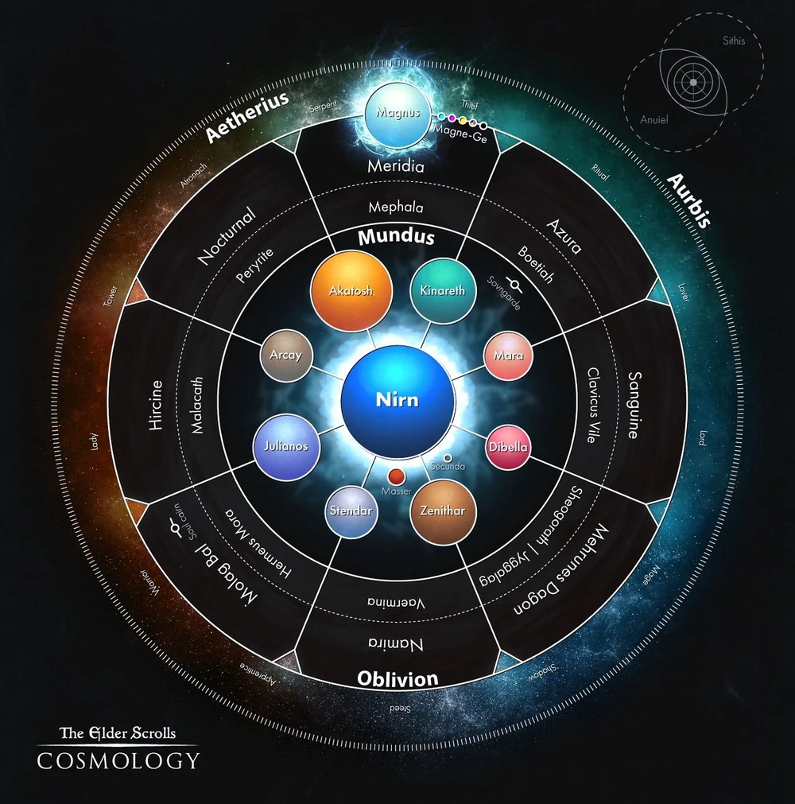
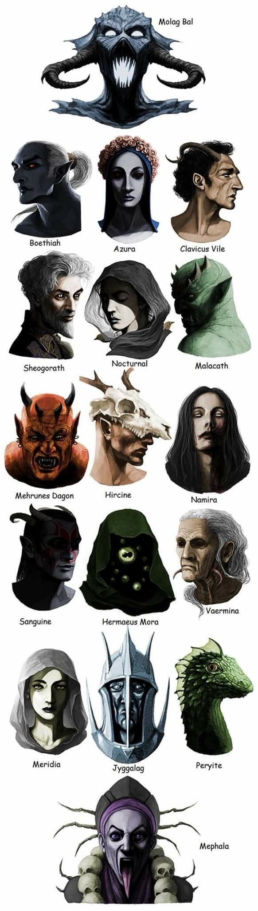
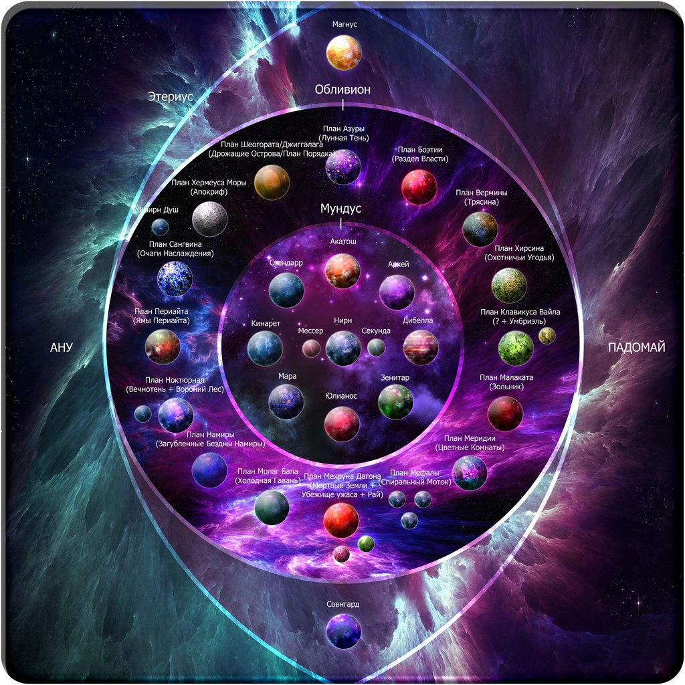

# [上古卷轴：宇宙学与Lore](https://vsbattles.fandom.com/wiki/User_blog:Matthew_Schroeder/The_Elder_Scrolls:_Cosmology_%26_Lore)

> 现在想想那神圣之轮，其与一切有关
> 
> ——次序真理

# 简介

大家好。希望你过得顺利。

六个月前，我给自己定下了学习上古卷轴宇宙的Lore和宇宙学的任务，目的是修改维基上的资料，这些资料的状态确实很糟糕。就在同一天，我发表了这个博客的原始状态，一个从Narutoforums上的各种博客和帖子中复制出来的组织性很差的集合。

那时，我隐约知道这个系列的一些高级概念和它怪异的宇宙观，但只是表面上的。我以为上古卷轴只是一个神话般的高级虚构背景，并认为理解它的宇宙将是一个相对简单的任务。

孩子，我过去的天真让人吃惊。我不可能离真相更远。

相反，当我开始慢慢深入研究Lore时，我发现了一个与其他任何游戏都不同的奇异宇宙，它有着令人难以置信的错综复杂的宇宙学，以及复杂而迷人的潜在形而上学，常常让人摸不着头脑。上古卷轴耗费了我几个月的时间，现在我又来了。

我已经准备好阅读虚构的众神和神奇的维度。结果我却读到了更高的维度、量子力学和阿莱斯特·克劳利的神秘主义。我不无讽刺地说，TES是我见过的最复杂的虚构设定。

但是，我们不要太过激动...... 我把真正困难和形而上学的话题完全留给另一个博客，以使我的生活易于管理，并给你们所有的时间来喘息。当我们到达那里的时候，我们会穿过那座桥。现在，我们将专注于该系列的"基本"宇宙学。

哦，还有一件事，我非常感谢[Ultima Reality](https://vsbattles.fandom.com/wiki/Message_Wall:Ultima_Reality)，感谢他为这个博客以及我对上古卷轴的广泛研究所做的大量（不可估量的）努力。没有他，我不可能走到今天的一半。我无法表达足够的感激之情。

说到这里，让我们开始吧

# 诸神之本质

在深入研究系列本身的宇宙学之前，重要的是要建立一个坚实的基础来解释上古卷轴中神灵的本质。

首先，诸神始终被描述为存在于时间与线性时间之外。这是整个系列多次提到的基本特点，最明显的是在晨风的维威克，即使处于极度虚弱的状态，他仍然称自己是超越所有时间的，并为你详细解释了诸神的本质 

> **锻莫**：
>
> “我不清楚锻莫发生了什么。我在尘世时间之外的永恒神圣世界中并没有感知到他们的存在。而且，事实上，如果我真的相信他们存在，我不会急于与他们联系……他们可能会以某种公正的态度让丹莫一族对他们的命运负责。我的直觉是他们已经永远消失了——这对我来说完全没有问题。” 
> 
> **成为神**： 
> 
> “这就像变戏法的。事物总是在移动，你学会了不用思考就知道它们在哪里。只是有很多很多事物在移动。有时，像任何变戏法的人一样，你会丢失某样东西。恐怕我最近丢失的东西变得越来越重要了，要做的事情太多了，没有足够的时间，我快失去了我的感知。也许我正在逐渐衰弱。” 
> 
> “这有点像既醒又梦。梦醒时，我和你在一起，思考和交谈。入梦时，我很忙，很忙。也许对于其他诸神来说，那些完全不朽的存在，也不过只是时间之外的沉眠。而我，我同时存在于时间之内和时间之外。” 
> 
> “永远不死也很好。当我在这个世界的时间中死去时，我就完全睡着了。我非常清楚我所要做的就是选择醒来。我又活了过来。很多时候我很刻意地试着耐心地等待，很长很长的时间才选择醒来。不管我等待了多久，当我醒来时，总是会发现时间一点也没有过去。那是神之域。时间之外之地，一切都在发生，同时的发生。” 

事实上，维威克在与你交谈的过程中将你带到了时间之外。 

> **任务**：
> 
> “不是很明智。但很好。我希望有人会毫不犹豫地宣誓。你现在会有一种短暂的时间流逝感。不要惊慌。你正在被带到时间之外，以避免学习如何使用灵护臂铠的不愉快经历。它会在那之前结束......”
> 
> [在完全黑暗中有一种短暂的运动感，漂浮着，但没有重量感或方向感。] 

即使是更低级的迪德拉本质上也是更高维度的存在，作为永恒存在位于时间之外，因为阿祖拉被描述为不受龙之囚笼（时间之流）束缚的“永恒”的生物 

> 你认为，因为你察觉到梦魇骏马和地狱猎犬的外表有表面上的相似之处，所以它们一定有某种“联系”。**凡人的思维总是通过将熟悉的事物可悲地强加在不方便描述的超角形态的实体上，来抵御它所不能理解的现实。**呸。反思我说的每一个，我的解释你一个都没理解，不要再给我提这种问题了”
> 
> \- 愚者克星利兰斯
>
> Nigedo：“被永恒束缚的魂灵啊，亲身体验世界轮势不可挡的行进，感受时间不断前行的鸣响折磨，尝受困于时间龙骨笼中生灵的绝望吧！”
> 
> \- 维威克的审判 

说到这里，上古卷轴中神与神性的另一个重要特征就是他们的位面，他们所统治的无限大的领域，与他们自己完全无法区分。它们是完全受其控制的思想和本质的延伸。 

https://www.elderscrollsonline.com/en-gb/news/post/25505 

> 法·努特·亨大人说：“为了回答你这个法师的问题，我将从具体到一般！**与那些更伟大的魔君们一样，我的大漩涡领域和我自己是无法区分的——我的袖珍现实是我思想、本质和意志的投影。事实上，作为我个人所展现的现实在我访问过的所有高度管理的领域中都是常态**。特殊的领域在几个方面偏离了这个规范。有一些物理领域，例如火元素的家园烈焰地狱，它们作为其众多不那么强大的居民的集体延伸而存在。根据我的经验，这样的‘集体领域’往往相当平凡和无趣，缺乏更多个人湮灭位面的独特特点。有一些不完整和半完成的半位面，即所谓的‘雏形领域’，由于某种原因被他们的投影者遗弃了——即使是对于强大的迪德拉来说依然是危险的地方，因为它很容易在漫游者的伏击中解体，或者被卷入一个领域撕碎。然后是我们所说的‘碎裂领域’，即被跨位面战争或魔君所驱逐粉碎的袖珍现实。为了回答你的最后一个问题，我知道除了个人或集体意志之外，没有任何有管理的湮灭领域被创造或维护。但我还没有看到湮灭中的一切。谁又可以？ 
> 
> 哈斯基尔：“您也有能力影响您所在领域的天气。因为它是您自己的延伸，它通常也会对您产生影响。您也享有谢尔格拉的保护。把它施在自己身上，如果您的生命受到威胁，您将被送回您的城堡。主人，这些能力中的许多都植根于群岛的魔法。如果你选择离开这个领域，它们可能不会起作用。”
> 
> \- 战栗孤岛 
> 
> 而当魔君们听闻了谢扎尔的举动，纷纷嘲笑它和其它的伊德拉，‘分割自己的一部分？然后还永远地失去它？这太愚蠢了！你们会后悔的！我们就比你们聪明得多，我们也会用自身创造一个新的世界，但是我们不会失去它，也不会让它嘲笑我们，我们会让这个世界成为我们自己的一部分，永远属于我们，并在我们的完全控制之下。’
> 
> “因此，魔君们创造了迪德拉国度，以及更弱迪德拉的所有等级，无论大小。而且，在大多数情况下，魔君们对这种安排很满意，因为他们身边总是有信徒、仆人和玩物。”
> 
> \- 谢扎尔之歌 

此外，湮灭领域可以是更高维度的，如果统治它们的魔君希望它们如此（下面的引用也有法·努特·亨详细说明了迪德拉是如何永恒且不朽的实体，它们看起来只是线性存在，受因果关系的约束，而这只是因为他们希望如此而如此）

> 法·努特·亨大人说：“我又打断了！强大的法·努特·亨，赫麦尤斯·莫拉的仆人？绝不！我是波耶西亚之裔，一个至高无上的半魔君，我只服务于我自己的意志！**至于时间、因果，就说龙神的法则不适用于湮灭吧。哦，在与凡人打交道时采用线性的时间很有用，所以你会发现大漩涡在这方面会非常熟悉。我们知道你在远离阿卡托什之手后会感到多么茫然！大漩涡比异典更容易理解**——而且更加慷慨，因为我们会为获胜的竞争者颁发丰厚的奖品！” 

https://www.elderscrollsonline.com/en-gb/news/post/25505 

> 法·努特·亨说：“啊！‘堰门’通向或将通向到滑流域，在那里你们凡人已经或将建立你们的战斗神塔学院。关于‘滑流’的名称：**当然，凡人只能根据他们自己的参考系来感知湮灭和梦达斯的天文区域。他们‘看到’的只是他们能理解的东西，而且通常并不多。**此外，他们所理解的东西似乎常常使他们发疯，尽管精神崩溃的速度因人而异。曾有两次，帝国马纳诺特人经常冒险超越奈恩，并在这样做时了解到凡人的思维最好通过温和的角度来适应其他现实。 
> 
> **这就是大漩涡看起来与你们世界的某些方面相似的原因之一——我希望它对凡人友好，或者至少对凡人足够友好，让凡人体验我的竞技场而不会扭曲他们的心态！**无论如何，马纳诺特人将了解到最好在过渡区的湮灭进行训练，在这个过渡区，不同的真理可以共存而不会产生概念上的磨损。在某些地方，跨越极限的力量在永恒的波浪中平衡，这些区域被称为‘滑流域’。我们实际上还没有去过战斗神塔，对吧，我的导师？请你记得帮我把这个‘堰门’告诉那些爱打听消息的人？” 

魔君们也可以统治一个以上的湮灭位面。一个例子是桑吉恩，他统治着超过100000个迪德拉领域。 

> “桑吉恩，纵欲之魔君，掌管着不下十万个袖珍湮灭。因为狂欢醉酒的昏迷受此魔君的影响，自第一帝国以来，他一直是众多皇帝的宠儿。甚至有记载表明，他在雷曼·赛洛迪尔统治期间居住在白金塔并帮助了克伦达利节进行了可疑的起草，其粗俗无助于帝国扩张到阿林诺和其他诸如夏暮岛。”
> 
> \- 魔君的帝国人口普查 

现在继续讨论宇宙学…… 

# 基础宇宙学

https://www.imperial-library.info/content/cosmology 

> ## 何为行星？
> **行星乃诸神及其诸神之位面，彼此等同。它们以球形天体的形式展现，由凡人之精神难以理解其本质，因而造成视觉之假象。由于每个位面（t）皆拥有无限体积的无限质量，同时还被湮灭虚空所裹挟，凡人的眼睛将它们视作为空间中的气泡。行星如此神奇且不可能**。八星对应着八圣灵。它们都存在于矮人的天体仪上，还有凡人之星，奈恩。
> 
> ## 何为奈恩？
> 奈恩（艾尔诺菲语意为"竞技场"）是一个由物质和魔法组成的有限球体，在时间之初，当洛克汗欺骗/说服/威胁众神创造凡世时，由所有的神星组成。**奈恩为凡人位面和凡人之星，彼此等同**。这场创世打破了宇宙的平衡；现在所有的魂灵（尤其是伊德拉-迪德拉/诸神-恶魔）都对奈恩（尤其是它的繁星之心，泰姆瑞尔）有着共同的利益。
> 
> ## 何为卫星？
> **小行星，就一个无限体积的无限质量可以比另一个小而言**。行星确实有轨道，或者至少双月的轨道被凡人认为是存在的。双月被不同的文化视作是他们的神星、次神或异神的随行灵。奈恩的卫星是马塞尔与塞昆达。矮人的天体仪中并无双月。
> 
> ## 何为马塞尔与塞昆达？
> 奈恩的卫星马塞尔与塞昆达（艾尔诺菲语意为"乔恩"与"乔德"）是凡世的随行灵。它们与凡世一样，是暂时且受凡世的约束；事实上，双月已经死了，而且早就死了。双月曾是纯白色且无特征的，但现在它们的'皮肤'正在腐烂和凋亡。它们的位面也同样在死亡。凡人认为这就是双月为何是球体，它们的'表面'被完全吃掉了；当月亮旋转时，它们似乎变成了碎片或破烂的月牙。这些并不是由阴影造成的，因为你可以通过球体月亮的黑色斑块看到群星。
> 
> ## 何为空间？
> **空间乃湮灭之诠释，它黑色且空虚，并环绕着凡人位面。虽其空间乃无限，但其行为仍像行星，因湮灭也被光界所裹挟**。你可以通过群星看到光界。
> 
> ## 何为群星？
> 群星乃通往光界之桥梁，即魔法位面。它们被认为是空间内部表面的洞。**因为它们在一个球体的内部，所以所有的群星都与奈恩等距**。也因此，较大的恒星并不是离凡世更近，它们只是湮灭中较大的裂缝。而湮灭中最大的裂缝是太阳马格努斯。
> 
> ## 那么，何为流星？
> 一个不恰当的说法。流星是物质和魔法的碎片，要么来自湮灭，要么来自光界，它们有时在宇宙中移动。**最大的流星实际上是具有独立轨道的行星，比如流氓位面的巴安·达尔。**
> 
> ## 何为星座？
> 星座乃群星之集合。**由于每一星都是通往魔法的桥梁，星座为非常强大的现象，并受世人尊敬。一般认为有13个星座**。其中九个完全由群星组成。**另外三个被称为守护星座，因为它们都由一颗统治之星管理。统治之星是阿卡托什（战士之眼）、朱利安诺丝（圣人之眼）和阿尔凯（盗贼之眼）**。最后一个星座是由非星组成，被称为蛇。
> 
> ## 何为太阳？
> **马格努斯乃是太阳，是湮灭中最大的洞，也是通往魔法的大门。马格努斯出席了创世，事实上，他是创世的设计师（洛克汗是其倡导者和灵感来源）。史前（ME2500之前，起始年）的奈恩是一个神奇的地方，对第一批凡人来说非常不稳定**。马格努斯后来离开了，有人说是出于厌恶，而湮灭则用虚无填满了虚空。他的逃亡并不容易，马格努斯的碎片以群星之形式留于苍穹之中。
> 
> ## 何为天空？
> 天空乃凡人之精神无法理解其本质所造成的另一种视觉假象，尤其是夜空。天空和行星一样是不可能的；**从本质上讲，当你看向天空时，"你看的是物质层面之外的东西"。在晚上，奈恩被湮灭所裹挟。白天的天空是太阳马格努斯七彩元素的斗篷**。它随着元素影响的上升和下降而改变颜色。因此，当人们看着白天的天空时，他们看到的是光界的外衣，并凝视着魔法。
> 
> ## 宇宙如何被创造？
> 那些被奈恩的住民解释为宇宙的魂灵之域的现象是在黎明纪元出现的。**它是通过魔法和神话创造的，在这个过程中被解释成无数种形式**，在此无法提及。这些神话可以在其他地方阅读。

大家应该已经看到了这一点。归因于宇宙内组织圣殿零点协会的游戏外文本。基本上是该系列的表面宇宙学的官方描述，它解释了有关它的基本知识。如果你想要对表面宇宙学的视觉描述，你可以观看这个视频： 
https://vsbattles.fandom.com/wiki/VS_Battles_Wiki?file=The+Elder+Scrolls%27+Cosmology

在以下部分中，我们将更详细地剖析和解释它，从凡人的位面: 奈恩开始。 

# 奈恩

在我们开始谈论奈恩之前，有一点非常重要，在它的原始状态，在黎明纪元，它是一个无形且不断变化的地方，时间本身以非线性方式展开，没有任何事件先于或继于另一个事件。在那个“时间”里，一切都是无限且永恒的，凡人和神没有区别，行为和实体以显喻的方式存在——只有在一些神牺牲自己并成为地骨之后，才变得线性和叙事上可能的记录，作为永恒的自然法则存在，通过原初之塔 阿达·曼提亚的力量，将奈恩和梦达斯作为一个整体稳定下来

事实上，据说黎明纪元的非线性和不断变化的性质正是整个泰姆瑞尔同一个创世神话有如此多变体的原因。“龙”，也就是时间，永恒的破碎和颠覆了，每一个可能性和答案都是真实的。本质上讲，如果线性时间是一条经历了时而分叉时而汇聚的线性路径的河流，那么黎明纪元就像一个水池，每一刻都是不分离且统一的

所以基本上，你可以认为每一个创世神话都是真实的，因为它们是同一历史不同方面的回响和映射

> 古艾尔诺菲在黎明纪元时破碎了，但就像当时的所有事物一样，这些碎裂得到及时的修正。起始之岛的位置时常变换，有时甚至不是一个整体，就像那些魂灵的实体一样。
>
> 吉尔们并没有它们的全部力量；相反，我应该说，所有的梦达斯的灵魂在每一次修正与每一次排序中都拥有每一种力量，也就是说，他们中没有人可以完全发挥出来；我们的世界还很年轻，缔造它的诸神也是如此。
>
> 接下来我们都以不同的方式知道，黎明的不确定性使所有记忆变得可信。我说的是乌尔·塔，精金，之后也称迪伦尼，以及它的建造和目的。
> 
> \- 努·曼提亚截获

现在，让我们来看看奈恩本身：

虽然通常被称为行星和有限的物质球体，但这是一个不恰当的名称，根本不能表达奈恩的本质。它是一个现实位面，就像之前在基本宇宙学文字中提到的梦达斯的所有其他位面一样。梦达斯被明确称为多元宇宙这一事实更能证明这一点。 

> 除了少数人之外，所有人都不知道，奈恩已经从多元宇宙的结构中解放出来，因为凡人的领域越来越接近冷港，冷港是支配和奴役的魔君莫拉格巴尔扭曲的湮灭领域。
> 
> \- 上古卷轴Online

事实上，晦涩的预言者称对于那些在三维中感知和观察现实的人来说，奈恩的海洋是更高维度的，无法理解的，这是一个更高存在的投影，他同时感知所有时间并将自己描述为更高维度的实体，在三维以上感知现实。

> 晦涩的预言者：海边的裂口！我喜爱大海。但遗憾的是，你只能在三维中看到它。所有的准调和逆数形式……其实，我收回了它？如果你看到这个，你的大脑就会爆炸。
> 
> \- 夏暮岛Online

这实际上完全符合[水由奈恩中所有事物的记忆构成的概念](https://imgur.com/gallery/2mzDJ)，以及[梅瑞德·楠达训诂]()一文，它与太阳之光相关联，由[梅瑞狄亚](https://vsbattles.fandom.com/wiki/Meridia)的领域过滤和操纵，然后投射到海洋，和“龙”一样，是时间的代名词。 

> “……因此，梅瑞德·楠达穿行于[骑过？划过？]彩虹之路，从这一头到另一头，一头拉伸着龙，另一头压缩着他……”
> 
> \- 梅瑞德·楠达训诂

考虑到这一点，不难理解海洋就是奈恩位面上的时间本身，因为记忆本质上是一个存在对时间流动的感知，而时间流动又可以与河流、水流相关联正如您在本节前面看到的那样，它穿过一条线性路线。

奈恩在黎明纪元没有海洋这一事实进一步支持了这一点，如上所述，这是一个时间不稳定并走非线性路线的时期，并且，无论出于何种意图和目的，都不存在，艾尔诺菲伊弗尔“解释”了由奥瑞·埃尔在奥比斯中创造的时间概念并将其建立在具有展开可能性的线性叙事中之前。

> ## 你能告诉我一些关于天空的故事吗？
> 
> 天映海，海亦映其镜。白天和黑夜之间的地方是天空的领域，正如伊弗尔解释的那样，阿努·埃尔在奈恩中建立了时间律法。因此，天空连接了时间和自然，并同时衡量两者
> 
> ## 这意味着什么？
> 
> 在任何给定时刻，在映射范围的每一半内，都蕴藏着奈恩之道的一半潜力。每一瞬间都是一种海洋或天空的状态。每个人都视其一为福或祸，而每个时刻也可以互相扭转。 
> 
> ## 时刻间的扭转有什么好处？
> 
> 每一个扭转的时刻都成为你道路上的一座孤岛。例如，一致的锻莫有他们的路。但有一个氏族——任性的洛肯氏族——抛锚航行于天空。为什么要这样做？他们深陷大海的泥沼中，并寻找着天空。
> 
> \- 在上古卷轴Online 中与编织者吉纳林的对话。

软泥怪寓言进一步强化了这一点，该寓言指出，在伊弗尔稳定世界之前，这片土地是无形的：

> 曾经，这里除了无形什么都没有。大地没有形状，树木没有硬化成木材和树皮，精灵们自己也在从一种形态转换到另一种形态。这种无形的东西被称为软泥怪。
> 
> 但是伊弗尔接过软泥并命令它。首先，她讲述了绿色、森林和其中的所有植物。她赋予了绿茵随心所欲塑造自己的力量，因为这是她的第一个故事。
> 
> \- 软泥怪：寓言

现在，为什么所有这些都与你问的Lore一致？因为它支持这样一个事实，即奈恩中的大陆是不同的时间点，并且通过航行于帕多美之海，你实际上是在穿越时间本身到达时间线的不同地点 

> 泰姆瑞尔就是现在。它实际上是时间的中心。
> 
> 阿卡维尔是东方，也是未来。
> 
> 尤库达在西方，在过去。
> 
> 从西到东旅行不仅意味着花费时间的航行，还意味着穿越时间。
> 
> 北方的阿特莫拉是冻结的时间。因此，它根本不存在。
> 
> 南部的古艾尔诺菲超出了时间范围。因此，它同样不存在。
> 
> 月亮？现在说到时间，他们真的很奇怪。
> 
> 它是线性的。它遵循一条线。
> 
> 线，如果你懂我的意思。 
> 
> \- Michael Kirkbride

参考尤库达存在于过去以及您在海洋中航行时穿越时间的事实，使用前面提到的月光线作为引导：

> 在离开贾布尔的第12天黄昏时分，在航海方面久经考验的科伊尔看到了非星座蛇，赛勒斯突然改变了向北的航向。老手向新人解释说，那天他们已经越过边界线，现在可以安全地驶向尤库达了。
> 
> \- 维威克大人与不安分的赛勒斯的剑术会面

Michael Kirkbride也再次提到了这一点，他表示对于阿卡维尔的居民来说，上古卷轴Online中的所有事情都已经发生了，所由莫拉格·巴尔发起的位面融合对他们来说已经是旧消息了。

> 对泰姆瑞尔发起的攻击对于阿卡维尔来说已经是过去的消息了。
> 
> 即使在 ESO 时代，阿卡维尔的抄写员已经写下了这一切是如何发生的。 
> 
> \- Michael Kirkbride

还有更多关于奈恩拥有超过三维空间的引用，同样是晦涩的预言者：

> 晦涩的预言者：“这里有一个缺口，伙计。我看到了一座桥……或者也许是一座人们可以走的平坦扁平的斜塔？我想它们是一样的。只有在三维才能让事情变得更简单。” 

以及奈恩真正延伸到何处是被凡人的视觉所看不到的。事实上，夏暮岛Online确定奈恩在本质上是完全万物有灵的，正如预言者所提到的，任何事物都有一个灵魂和一个思想，即使是像山脉、岩石和雪人这样的事物 

> 晦涩的预言者：“肯定是附近的裂缝。哦，太吵了！这个地方气氛真紧张，嗯？可能与山脉相互挤压有关。谁说的？” 
> 
> 晦涩的预言者：“雪！我们可以做一个雪人吗？雪人？随便？你知道，如果你做对了，它会发展成为一个悲伤的小灵魂！'当然它稍后会融化。有点遗憾，但我们能给它起名字，还有所有的一切！ 
>
> 晦涩的预言者：“更多的废墟。嗯。你知道，每块石头都在讲述一个故事。顺便说一句，我的意思是字面意思。那边的那堵墙不会因为它多么讨厌下雨而闭嘴。让我们找到这个缺口，然后离开这里，嗯？” 
> 
> 无魂者：**不过，这些只是头衔。你有真名吗？**
> 
> 晦涩的预言者：我当然知道。一切都有名字。名称赋予事物形状。鸟儿、雪花、茶壶……你懂的。我会告诉你我的，但你需要大约六个舌头和一对钹才能正确发音，所以不要打扰我了。” 

所以，总而言之：奈恩本身就是一个现实位面，如果你愿意的话，它就是一个时间轴。 

然而，梦达斯的多元宇宙还包含与奈恩并存的众多平行世界和交替现实，有时也被称为“毗邻之地”。Lyg就是这样一个地方： 

> 毋为恕而谢罪。非声，无过。邻地，掠者所居，乃声、心中域之幻，吾之所谓乃其构也。
> 
> \- 维威克的36课
> 
> 哈诺特横移至毗邻之地，增长不断，且不为人所知。于声之上，彼因不朽之新情而栗，乃纳中界尚存已知之情三十有余。当是时也，哈诺特变矣，甚为念家，然，掠者夺之。
> 
> \- 维威克的36课
> 
> Lyg是泰姆瑞尔反向的咖啡污渍，我已经告诉过你了。有一次奈恩被折叠起来，折叠后的太空风格就像沙丘刺激的领航系统。结果就是Lyg。
> 
> \- Michael Kirkbride
> 
> Lyg：它是毗邻的地方之一。它仍然存在。我不会称它为不同的前世，而是泰姆瑞尔的平行版本。
> 
> \- Michael Kirkbride 
> 
> 无魂者：**你为什么被困在水晶头骨里？**
> 
> 晦涩的预言者：我不在头骨里。我就是头骨——至少在奈恩上是这样。在毗邻之地，我的形状像一个抱枕。设想一下！你看起来很困惑。这只是光的把戏，伙计。头骨就是你所说的显现。 

上古卷轴中的阴影不仅仅是光的缺失，而是不同世界的反射和记录，以及不同的力量冲突在过去和未来中创造的个体存在和可能性。还值得一提的是，这些文字如何提到所有可能的世界都是真实的，以及强大的暗影大师可以同时将自己与所有替代版本合并，尽管风险很大。 

> 暗影第一卷
> 
> “……选择探索世界与阴影的这种关系，**阿兹拉是第一个意识到阴影不仅仅是光的缺失，而是战争中的力量创造的可能世界的倒影。光打在岩石上，影子是他们战争时的记录，过去，现在和未来。**
> 
> **其他相互冲突的力量产生了不太明显的阴影、火与水、风与石或战争中的国家。**
> 
> “凭借技巧和耐心，**所有人的阴影都可以被解读，模式可以被梳理、强调或消除。**
> 
> 操纵阴影，可以通过腐化来操纵投射它的物体或力量。” 
> 
> 暗影第二卷
> 
> “……阿兹拉进行了前所未有的尝试，**将自己的影子操控到如此程度，以至于他同时实例化并融合了所有可能的阿兹拉，从这个单一的存在跨越到了所有阴影中的存在。**
> 
> 无知的红卫士兵害怕阿兹拉的力量，将他困住并与阿兹拉对峙。
> 
> 巫师的战斗并不顺利。
> 
> 在以他的名字阿兹拉十字路口命名的村庄，仍然可以看到当他失去对魔法的控制时炸开的洞。 
> 
> 那天暗影学派失去了一位伟人，尽管其他人，例如 佩尔根·阿苏尔，正努力取代他的位置。” 

龙破是将线性时间打破成许多同时发生的较小的事件碎片，然后再重叠和合并在一起。这是为了让玩家能够在游戏中获得多结局。这也让泰姆瑞尔历史学家的工作变成了一场噩梦。 

> 你们是问，当龙破之时凯吉特人在哪里吗？瑞雷特告诉你：我们在记录它。‘一千零八年’，你听说过的。你认为西罗-诺德人自己想出来的。你们人类是比瑞雷特还厉害的小偷！当你们与暗影打仗，并被你们的父亲生养时，是鬃毛观察着贾·卡杰，因为月亮是唯一不变的事物，而你没有糖，所以不能看到
> 
> \- 龙破之时你在何方？ 

# 梦达斯和湮灭

奈恩及其平行世界本身包含在梦达斯中，如上所述，梦达斯被明确描述为多元宇宙。它由双月，它们是次级神的位面和比奈恩更高的无限位面，以及行星，甚至更大的无限位面和重要神的位面，例如阿卡托什和阿尔凯组成

梦达斯本身被湮灭所裹挟，一个无限的虚空，它本身包含无数无限大小的位面，这些位面本身体现了所有的可能性，因为迪德拉本质上是帕多美性质的魂灵

> 我有一个问题要问利兰斯阁下，但我认为它更多地是关于一些种类较少的迪德拉之间的关系，而不是这里处理的等级问题。我希望这值得您的关注。我们都认识到凶猛的爬行动物迪德拉斯，但我也听说过另一种不明确的所谓“火之守护者”，它似乎与迪德拉斯有身体上的联系，但它似乎更聪明。我曾经见过类似的东西，当时我遇到了可怕的“悬崖上的闹鬼者”。关于讨厌的班金和"同形体"，我们可以在"假设的背叛"剧本中看到类似的疑问。它们是同一种生物吗？而据说是梅鲁涅斯·大衮的品种的可怕的梦魇骏马与传说中喷火的地狱猎犬之间是否有关系？
>
> 感谢您的恩典，我想最后承认所有这些生物之间有着怎样的联系，它们在湮灭的层面上有着共同的起源。"
>
> \- 肖克·纳尔·里霍恩
> 
> 愚者克星利兰斯说：“凡人啊，你的问题体现在你的话语中，‘在湮灭的层面上有共同的起源’。”在湮灭的位面之间，或跨越湮灭的位面，没有任何‘共同’之处——”它们是变革和突变的定义，展现了所有的可能性，并证实了所有的理解和误解。你们在只有差异的地方寻找相似之处，一种混乱的分类。”你认为，因为你察觉到梦魇骏马和地狱猎犬的外表有表面上的相似之处，所以它们一定有某种“联系”。凡人的思维总是通过将熟悉的事物可悲地强加在不方便描述的超角形态的实体上，来抵御它所不能理解的现实。呸。反思我说的每一个，我的解释你一个都没理解，不要再给我提这种问题了”
> 
> “啊，看来我的记忆孢子传送成功了。你明白我为什么不愿在像你这样的人面前露面。我不傻，我猜是我帮你赢得了你的头衔。那么，回答问题吧。
>
> 首先，一个魔人得到晋升的情况有多普遍？我知道你的人有严格的军事等级制度，在湮灭中不断有战争发生。这必然意味着迅速的晋升和降职，大概是指指挥官由于可耻的失败而暂时与身体分离。你能给我讲讲吗，可怕的战士?
> 
> 还有一件事——你的“堂兄弟”希维莱。你对他们有什么看法？我听说他们体格强健，但很难训练成士兵，只能作为雇佣兵和魔君的助手。这是真的吗？还有，如果你不介意我问的话，你和希维莱人打架谁会赢？我无法抗拒这个问题，尤其是因为我现在和你处在一个不同的维度。”
> 
> \- 布莱顿帝国复辟协会基克伦弗斯公使
> 
> 愚者克星利兰斯说：“虽然你是一个卑微的虫子，我将回答你的两个问题，希望这会激怒Eis Vuur Warden，这样他就会找到你的‘肉体’来报复我公然的偏袒。”（毕竟，我也会这么做。）关于晋升和降职:一个严格的等级制度定义了等级之间的关系，但并没有规定一个人必须达到什么等级。（当然，除非它真的出现了，但进一步解释超出了我愿意回答的范围。）为了服务于一位伟大而好战的大师，个人的解体是经常发生的，但等级制度必须坚持！在这种情况下，为了维持指挥网络，改变军衔是必要的。
>
> “**啊，希维莱。在所有的湮灭中的无限世界中，存在任何迪德拉，比那些无礼和不守规则的笨蛋更浮夸和充满了毫无根据的自负吗？**的确，他们的蛮力和卑劣的狡诈使他们在某些罕见的情况下成为有效的特工，但在大多数情况下，他们是可悲且不可靠的。你可能也知道，我们主人的私人护卫，希夫金，就是在邪恶实验室里残存杂交实验的结果。乍一看，他们似乎是可以接受的盟友，但在魔人完全信任他们之前，我们需要看到一两个古生人通过，给我们一些记录。”

在整个系列中，湮灭领域的无限的大小也以正确的英语表达了出来。

赫麦尤斯·莫拉的异典领域被多次描述为无限（还有其他例子）：
> 
> '''默里安·泽纳斯向我描述了一个无穷无尽的图书馆，书架向各个方向延伸，一排又一排。'''书页随着神秘的微风飘荡着，而他却无法感受到这股气流。每本书都有着没有书名的黑色封皮。他谁也没看到，可是他感到有幽灵在书架中穿插，穿过书从，不停搜索着。
> 
> '''这是异典。 赫麦尤斯·莫拉的故乡，在这里可以找到所有禁忌的知识'''。我心头一颤，却分不清是师父的还是我的。
> 
> \- 湮灭之门
> 
> ''' 赫麦尤斯·莫拉的无限档案是终极宝藏。它无数的书架和无数的书籍承载着所有知识的重量'''。在其中，勤奋的读者可以找到过去的一切，现在的一切，以及将来的一切。
> 
> 神明的追随者满足于他们无知的黑暗修道院，宣扬对黄金之眼的仇恨。迪德拉，他们称他为：不洁、可怕、邪恶。
> 
> 我们已经看到了真相。知识只与掌握知识的人一样邪恶。因害怕误用而放弃学习是最大的罪过。这是一个不可原谅的愚蠢行为。结果，凡人遭受了无数个世纪的损失。
> 
> 在异典中，金色的眼睛为这种无知的疫病流下了冷泪。 '''那些走过他的大厅的人真的有福了。即使他们的肉体脱落，他们也被允许浏览无限的书籍和卷轴，了解曾经和将永远存在的所有奥秘'''。它是最幸运的命运。
> 
> 我们赞美你，赫麦尤斯·莫拉。我们寻求启蒙、启发和在您身边的位置。
> 
> \- 异典

在小说地狱之城中，湮灭的各个领域也被描述为无限大： 
> “待在一起！”苏尔喊道。他走了一步，又是一种难以想象的感觉，现在他们陷入了一片漆黑，但不是寂静，因为他们周围到处都是叽叽喳喳的声音和的成百上千断断续续的奔跑声。
> 
> 他们在一座彩色玻璃的无限宫殿里。
> 
> 他们坐在一个冰冷的位面上，天空熊熊燃烧。
> 
> 他们站在一条深红色的河边，鲜血的气味几乎让人窒息。
> 
> 他们在阿特雷布所见过的最深的森林里。
> 
> 他为下一次跳跃做好了准备，但苏尔突然骂出声。
> 
> “什么？”阿特雷布斯说。“我们在哪里？这还是湮灭吗？”
> 
> “是的，”他说，“我们被打断了。他一定是嗅出了我的诡计并设下了陷阱。”

阿祖拉之星展示了其内部包含的完整现实，并被描述为无限。阿祖拉之星只是她的神器，不是她的领域。这给出了迪德拉位面真实规模的概念： 

> “我已经净化了阿祖拉之星，无限灵魂的宝石。我觉得合适就可以了。”
> 
> \- 都瓦克因日志

被召唤到奈恩的魔人也明确地将湮灭描述为包含许多无限的无尽黑色虚空。

> 整个位面在我周围旋转，我感到头晕目眩，差点掉进了一片蓝色原生质里，'''然后，我忽然感到自己被扔进了无尽的黑色虚空。'''
> 
> '''我一开始并没有惊慌，因为谁没有被扔进过无尽的黑色虚空呢？'''直到我到达目的地，呼吸到新鲜空气，我才有了第一个疑虑。 “我闻到了……弱者的气息，”我对自己说——我再正确不过了。就在那时，我第一次听到了我的召唤师的声音，他说：“啊，这个看起来还挺健壮的”，我对我的处境充满了恐惧。因为我被召唤去执行一个……凡人的命令。
> 
> “我惊愕地转过身去，看看谁竟敢跨越无限将我召唤到奈恩”，然后发现自己面对的是一个高大的夏暮岛精灵
> 
> \- 我被凡人召唤

然而，尽管这些说法令人印象深刻，但这些陈述可以说是误导性的，远不及湮灭的真实规模。事实上，湮灭虚空本身被描述为具有无限维度： 

> 要知道在泰姆瑞尔以外的地方，狡猾和警惕的人可以去学习被遗忘的咒语。我说的就是湮灭位面。无限维度的海洋包含了一系列无穷无尽的岛屿。有些被强大的魔君控制；其他岛屿则与一位或另一位次级魔君有松散的联系。在这些岛屿上，居住着超越时间的神秘生物。有些人出于自己的意愿来到那里，但其他人则因犯下滔天罪行或幻想中的罪行而被驱逐到那里。
> 
> \- 鲁兰塔里的笔记

这句话肯定是指空间维度，因为它用于表示湮灭本身的特征，而不是它包含的某些东西。还有一个事实是，本文将湮灭位面称为“岛屿”，而不是维度或任何其他术语，因此在这里试图将本文视为指宇宙是不可能的。

还有其他一些将湮灭视为更高维度扩展的例子，例如下文限时之桥，其中指出“超角”媒介对于穿越梦达斯和湮灭以及在两个领域之间打开一个持续时间超过无限小的大门是必要的

> 在没有稳定的超角介质充当媒介的条件下，任何加速对象或实体跨越界域的穿梭都是不可能的，即便可能，也会导致被传送物瞬间的衰灭。只有构建跨界域的穿梭通道才能够维持大于无限小时间的跨界域穿梭。
> 
> 虽然其他的超角介质理论上可能存在，但是目前所知唯一的能维系穿梭通道的跨界域物件就是印记石。印记石是一种前神话纪元的类晶体灵介器，通过获得迪德拉印记的能量，可以转变成一种超角存在的魔法物件。虽然一些其他的灵介器，例如灵魂石，可以在自然环境中获得，这种特殊的灵介器仅能在湮灭领域的深渊中获得，因此若无迪德拉力量的帮助，凡人无法探寻或获得。
> 
> 因此，既然充当超角度介质的灵介器和迪德拉咒符都无法在不与魔君协作或交易的情况下获得，跨界域穿梭的实行者必须培养一定的咒术系魔法知识——尽管若该施法者有能力获得的话，一个特殊设计的附魔物也可以替代其效果。与迪德拉领主协作和交易是一项高深但是有广泛研究的技艺，不在本文论述之列。
> 
> \- 限时之桥

晦涩的预言者也在他的对话中提到了更高的角度。当他还谈到感知更高维度的空间时，毫无疑问他指的是： 

> 无魂者：您喜欢我们的旅行吗？
> 
> 晦涩的预言者：“我吗？扁圆的认知形式有无限的角度吗？请不要贬低自己。答案是肯定的。太棒了。那些景象，那些气味，你所有的装备在我脸上不停地叮当响。梦想成真了，伙计！”
> 
> 晦涩的预言者：“我得承认，我有点被审美迷惑了，伙计。没有非绘画，少于一千个角度，几乎没有任何跨界球体......我不知道。我会给它一个柔和的“足够”。”

前往迪德拉位面也被描述为同时从各个方向坠落： 

> 前往真正的迪德拉领域的感觉“就像坠落——不是一般的坠落，而是同时向各个方向坠落。双月不见了，取而代之的是烟雾和满是灰烬的天花板。令人窒息的热量包裹着他们，空气中充满了硫磺和热铁。他们站在黑色的熔岩上，火湖在他们面前伸展开来。”
> 
> \- 地狱之城

# 众塔

在黎明纪元，在发现洛克汗创造凡世的意图后，众神联合起来召开了一次会议，该会议将在奥比斯时间之外举行，称为公约，在那里，洛克汗的惩罚将在众神离开奈恩前进行适当的讨论

为了制定公约，阿卡托什的飞船撞击陆地，并固定在陆地上作为一座塔。通过公约，它将在奈恩的叙述中定义地骨并构建它们的本质，有效地使其成为黎明纪元非线性中第一个坚实而无懈可击的现实，因此它被赋予乌尔塔的名字，或阿达·曼提亚。

> 尽管如此，一个被许多文化所接受的经久不衰的故事是，当世界凝固成现实时，众神建造了一个巨大的塔来讨论如何最好地继续创造梦达斯。奈恩的物质、时间、精神和魔法元素都在这个大会上被确立，即使一些神消失在光界中
> 
> \- 帝国袖珍指南第三版：纪元
> 
> 那尖峰阿达·曼提亚及其零石决定了其在奥比斯周遭的现实结构，随着龙之传说的展开（或者说，是在时间的进程中）为地骨定义其故事或本性。先祖或是神话纪元的精灵，其使命皆是独一无二的，直到他们领悟到了一个事实：其他具备各自原石的塔也可讲述不同的故事，并遵循集注建筑者所镌刻的规则。为此，精灵们将自我折射进他们自己创造的象征，歧莫追随红山之心、波兹莫培植绿液、傲特莫竖立起水晶律法，等等等等。
> 
> \- 奥比斯之谜：远古之树
> 
> 奥瑞埃尔或者阿卡托什从他的统治星球回到了梦达斯竞技场，示意所有的伊德拉在奥比斯时间之外的地方召开一个静止会议。他那光滑的银色飞船变成了尖塔，并撞向不断变化的奈恩，其冲击的微光风警告任何与它一起进入光圈的灵魂将被记录下来——如果他们同意在场，他们在这里的行为将持续一段坚不可摧的时期，无论这些灵魂以后会怎样，即使他们重新回归光界或自愿屈服或因背叛而被西斯特抹除。因此，伊德拉和他们的同伴才能真正地在现实中凝聚。
> 
> （...）
> 
> 公约的结果是在他们离开陆地后，为了奈恩自身，它应该像阿达·曼提亚的表象一样持续下去。梦达斯被赋予了它的第二座塔，红塔，其最初原石是世界之心，"如图所示"。
>
> 时间开始以阶梯的方式行进。那些留下来的魂灵，无论大小，无论自愿还是最终的地骨，都放弃了对神性的绝对控制。
> \- 努·曼提亚截获

因此，在洛克汗的惩罚决定后，阿卡托什将他与他的神圣心脏分离，将他的心脏撕裂并扔向泰姆瑞尔，在它降落的地方形成了一座以心脏本身为中心的巨大火山。然后形成了第二座塔，红山，它送给了奈恩一个神圣的火花，让它得以在没有众神的情况下继续存在。

从本质上讲，塔是形而上学的构造，作为阿达·曼提亚的回响，由作为其力量来源的“石头”（不是字面的石头）提供动力，如果有什么东西切断了与它们各自原石的连接，塔就会失活。

> ## 何为塔？
> 
> 它们是乌尔塔魔法和物理层面的回响，即阿达·曼提亚。阿达·曼提亚是黎明纪元中首个不可动摇的现实之尖峰，也被称为零石。阿达·曼提亚的力量能够通过这块原石确定造物的范围及其他们在其中的角色。
> 
> 这些力量还创造了红塔和最初原石。这使得梦达斯可以在圣灵完全不在的情况下得以存在。通过这种方式，阿达·曼提亚的力量赋予了梦达斯一种特殊的神性，这被称为奈恩，是命运变化的结果。
>
> \- 努·曼提亚截获

塔及其各自的原石如下：

- 精金塔/阿达·曼提亚（零石/公约）
- 红塔/红山（洛克汗的心脏）
- 水晶塔/水晶律法（透明律法的核心）
- 白金塔（诸王护符/Chim-El Adabal）
- 雪塔/雪喉（不明，说是“洞穴”）
- 绿塔/绿液（可能是橡子）
- 山铜塔（不明，据说是一把“剑”）
- 黄铜塔/行走之黄铜（洛克汗之心/曼特拉）

虽然起初以不同的目的建造，但这些塔是创世的轴线，负责阻止湮灭虚空将梦达斯融入到它的浩瀚

> “嗯，白金塔——以及泰姆瑞尔周边的其他的塔——帮了大忙，它们稳固住了世界，或类似的东西。其他人认为在龙破之前，塔有助于保护我们免受湮灭的入侵”
> 
> “它稳固了世界？”
> 
> 我不是对它说，”他回答说，意识到他实际上无法记得那教导的细节。“他们帮助保护梦达斯——世界——融入到湮灭。或类似的东西。无论如何，每个人似乎都同意它有这种能力，但没有人确切知道是哪种。
> 
> \- 地狱之城
> 
> 它是塔。这是关键。直到科林记住其中一个符号意味着'回响'，我才明白过来。白金塔是乌尔塔的回响，我们现实的最初之物由诸神所创造。这是创世的轴线之一。
> 
> \- 阿瑞斯, 地狱之城

为了实现这一目标，它们集合力量不断利用神话能量——“创质”——从光界开始建立两个领域之间的屏障。如果所有的塔都失去活性，整个梦达斯的多元宇宙将会不复存在

> ## 何为原石？
> 
> 原石是零石的魔法和物理层面的回响，通过它，塔可以集中其能量来塑造造物。通常情况下，原石从湮灭中借来多余的造物，将其嫁接到指定塔的地面区域。
> 
> 过去和现在都很难绕过湮灭，直接进入造物的源头，光界。但现在它已经被做到了，不过并非没有付出巨大的代价，无论世俗的还是其他的。然而，进入湮灭，即环绕梦达斯竞技场的虚空，我们可能每晚都会接触到它，与光界相比，这简直是小儿科了。
> 
> 来自光界所培育的创质冲破虚空成为原石之间的律法。
> 
> \- 努·曼提亚截获

除此之外，塔的力量最主要的例子是水晶律法，这是一种形而上的结构，锚定了梦达斯的每个现实和位面，遍及所有时间和空间。索萨·希尔甚至将其描述为通往多元宇宙一切的大门，以及通往无所不在的钥匙。

> 无魂者:“我们需要你的帮助来阻止诺克图娜尔。告诉我，你想对仪式大师说些什么。”
> 
> 索萨·希尔:“一个要求?有趣。
> 
> 那么请听我的话。诺克图娜尔盗走了一个我以为藏得很好的秘密。我发明了一种利用生命能量作为能源的技术。我猜她会用这种技术来增强水晶塔。”
>
> 无魂者:“增强水晶塔有什么用?”
> 
> 索萨·希尔:“水晶塔同时存在于现实的多个位面上，拥有我们无法完全理解的能力。我们必须假设诺克图娜尔想要无穷的力量。
> 
> 我建议你去找瓦尔希伦，把这一进展告诉她。”
> 
> 无魂者:“诺克图娜尔不再与其他魔君合作。”
> 
> 索萨·希尔:“我很难相信诺克图娜尔、梅法拉和维尔在一起合作了这么久。魔君们并不愿意互相合作。
> 
> 有了心脏，诺克图娜尔离控制那座塔又近了一步。”
> 
> 无魂者:“为何心脏如此特别?”
> 
> 索萨·希尔：“水晶律法，水晶塔顶部的水晶，所有现实都被这形而上的结构锚定。有了心脏，她可以重塑水晶，利用它的能力，并使自己完全掌控这座塔。”
> 
> 无魂者:“水晶塔是如何同时存在于多个位面上的?”
> 
> 索萨·希尔:“这座塔跨越了所有现实。它的真正用途现在还不清楚，但我认为它是作为某种观察塔所创造的。通往一切的大门。
> 
> 因此，有理由认为，那座塔是通往无所不在的钥匙。"
> 
> 无魂者:“这对诺克图娜尔有什么帮助?”
> 
> 索萨·希尔：“试想一下，一位能够同时对整个多元宇宙造成影响的魔君。诺克图娜尔将拥有无穷的力量。
> 
> 如果她做到了这一点，那么她的力量就会相应增加。她将……没有事物能够限制她。”

白金塔也被描述为与梦达斯的所有位面相邻并同时存在:

> “白金塔底部的帝王王座室是所有梦达斯中最重要的形而上的中心点之一，如此之多，以至于它几乎可以说是毗邻于伊德拉所创造的所有时间和空间。”
> 
> \- 夏暮岛Online

# 光界与奥比斯

光界是超越时空的纯魔法的无尽领域，裹挟着湮灭和梦达斯。作为一个比这两个领域都要更高的无限，并且是所有魔法的源头，它通过太阳冲刷着奈恩，那是魔法之神、马格努斯和群星在湮灭结构中创造的一个洞，这些小洞是由马格纳吉创造，跟随马格努斯逃离梦达斯时的次级魂灵

> ## 我想听听关于光界的故事。
> 
> “光界是光之海，不朽位面，魔法的源头。伊弗尔不是为光界而歌，但却又是为它而歌，编织一首如此美妙的歌曲，以至于群星被迫起舞和摇摆。他们仍然眨着眼睛回忆那首歌。
> 
> ## 群星与光界有什么联系？
> 
> “它们就是光界。相反，太阳和星辰是马格努斯和其他魂灵在湮灭中撞出的洞，试图逃离奈恩。”
> 
> “这些洞允许光界的光进入我们的世界。从它们那里到我们这里，魔法如同涓涓细流。”
> 
> ## 那么它们是如何闪烁并在天空中移动的呢？
> 
> “好吧，考虑一下。因为湮灭是一个由多个位面组成的领域，所以，光界也是一片明亮的海洋，里面有着许多的领域。这些星星中的每一个都是进入这些领域的窗口，随着这些领域的移动，它们也随之移动。或者关闭，就像门一样。”
> 
> ## 你口中的领域是什么？
> 
> “这是一个我目前无法回答的巨大难题。许多凡人的灵魂在那个地方变成了另一种灵魂——这就是我唯一可以肯定地说的。尽管前往湮灭已经非常困难了，但光界比它还要难得多。”
> 
> \- 编织者吉纳林的对话

光界也是所有魔法的源头，被描述为无限的海洋：

> 古老的亚历德相信奈恩由四种基本元素组成——土、水、空气和光——在这四种元素中，他们认为最崇高之光的形式是星光。群星是我们与光界位面的链接，光界位面是所有魔法力量的源头，因此，来自群星的光是所有魔法力量中最强大和最崇高的。
> 
> \- 来自群星的魔法
> 
> “光界是一片深邃、黑暗、无尽的海洋。魔法的秘密以及它无数的形式和表达方式也是无穷无尽的。把我当作导师，只要你值得我指导。”
>
> \-康纳莱维

现在，还记得您需要超角度的媒介在梦达斯和湮灭之间移动吗？好吧，去光界要困难得多，据说前往湮灭很困难，但与前往光界并实际对它造成影响相比，这只是儿戏。

> 原石是零石的魔法和物理层面的回响，通过它，塔可以集中其能量来塑造造物。通常情况下，原石从湮灭中借来多余的造物，将其嫁接到指定塔的地面区域。
> 
> 过去和现在都很难绕过湮灭，直接进入造物的源头，光界。但现在它已经被做到了，不过并非没有付出巨大的代价，无论世俗的还是其他的。然而，进入湮灭，即环绕梦达斯竞技场的虚空，我们可能每晚都会接触到它，与光界相比，这简直是小儿科了。

包含梦达斯、湮灭和光界的“多元宇宙”在艾尔诺菲语中被称为奥比斯，即“竞技场”。然而，这三个领域并不是唯一包含在奥比斯中的领域，事实上，它强烈的暗示了远远超出光界之上的无尽领域：

https://www.imperial-library.info/content/eso-alinor-and-ayarene

> “光界只是第一层，我目睹过光界之外。”

http://en.uesp.net/wiki/Online:Lilatha

> 无魂者：“我可以见见他吗？”
> 
> 莉拉萨：“也许有一天。赛伊克教团的阿塔尤姆岛已经不复存在了。他可能会及时回来，但现在你可能会更容易到达光界或之上的领域。
> 
> 教团重视孤独，就像索萨·希尔一样。”

此外，奥比斯被描述为包含无限个角度，线性时间只是其中的第一个。这意味着无限的时间维度，并且与我们迄今为止在 TES 中看到的关于更高维度和更高角度的Lore是一致的。

> 现在想想那神圣之轮，其与一切有关。
> 
> **有比那轮更神圣之物吗？如同泰姆瑞尔之终（Tamriel Final），轮既运动又静止。阿努凡纳希（Anuvanna'si）。轮轴沉睡，而辐条匆匆不止——在反射环中转动，周而复始。**现在，此处有一无名秘密，审判席之子：某物在旋转之时，可否算作运动？
> 
> 运动深植于存续奈恩（Nirn-Ensuing）之核心，然则，并非所有运动皆无名，并非所有运动都能获得“他”之祝福。
> 
> **神圣节拍器将第一运动称为“线性运动”。线性运动乃是头脑简单之辈的运动——乃软弱意志之运动，乃学者之虚荣。“前进！”它在叫唤！**向廉价野心的果实前进。向永恒诸国的应许前进。向圣贤们所谓“进步”的海市蜃楼前进。**这些误入歧途的先驱者冒险进入他们狂野的明天，以及之后的未来，来确定他们的价值——他们的美德。但是，于一人或一精灵而言，专注于单一未来有何益处？凡人之目标狭隘，太过狭隘！前进即是忽略无穷角度，而选择单一方向。**此兽类之行动，竖子之作为。发条之神以勇气之名义摒弃虚荣，这些探险之人的旅程只会让他们远离泰姆瑞尔之终。阿努凡纳希。
> 
> 塞特低声说出第二运动。“钟摆”或“有名震荡”——无序状态及虚假希望之运动。唯有发条之神可索取其黑暗之力。它每一次大幅摆动皆诉说出洛克汗得谎言。“万岁，意图分裂！万岁，诅咒之多样！”不可立于钟摆之轨道，灰烬之子。唯有永远上弦的主发条可承受其重。
> 
> 最后的运动乃往复运动。“崇高的活塞”。情人之怀抱。如神秘之父一般，其乃等量授与受。如琴弓之弦，奏出壮美之音。如木工之锯，来回拉动，粉碎次等精灵可名状之追求。唯有无名之心可驭其力。艺术家、观星者与工程师称其为“灵感之源泉”。未见真理之众称其为“毁灭者”。
> 
> \- 次序真理 - 第七卷

索萨·希尔的发条城是一个无止境的机械现实，它复制了整个梦达斯的物质位面，基于奥比斯的结构，即世界中的无尽世界和无尽的轮中轮。

https://www.twitch.tv/videos/181958467

> 吉娜·布鲁诺："有人问我...如果发条城是某种平行宇宙，那么它是否会是无止境的。"
>
> 劳伦斯·希克：“有点儿。这两个问题都有点儿。事实上它是一个有意为之的平行宇宙，因为它故意平行于泰姆瑞尔之上。还有...第二部分是什么？”
>
> 吉娜·布鲁诺 & 莱蒙·塔特尔："它是否是无止境的"
>
> 莱蒙·塔特尔：”它是否是无止境的？你几乎不能从游戏中看到所有的一切。**它有层次，只有索萨·希尔知道这些层次的全部范围和其他一些领域的作用是什么**...萨曼莎，你能向后靠一下抬头看看天空吗？抬头看看，看看那些旋转的圆环围绕着发条城的世界旋转。那是发条城的外面...或者不是。这就是你可以从黄铜要塞中看到的，**你可以看到索萨·希尔采用了轮中轮和世界中的世界的概念，并让它在你的头顶上展现出来**。所以你会不断思考这个事实，这个世界是一个被创造的东西，因此它可以被逆向工程，重新设计和改良！看，证据就在你头上！所以，是的，这如地狱般深刻！该死，这东西太深刻了！”

举个例子，在维威克的36课中，奥比斯被描述为一个轮子，一个圆圈：

> 此轮之经也，其一：
>
> “轮辐，混沌之八部，至今犹为时之法所固：静态之变，若愿，依鼋之众神唤曰“击”。其为匍匐者之轮，盘绕之潜能，永不动之序也。”
>
> 其二：
>
> “其为伊德拉之遗骨，西帝斯赐福之八肢，新星之湿土，我辈居之也。其外为乃奥比斯，而其内非也。如诸多不解之事，其为一圆。圆者乃晦涩之巨蛇，攻不已，而不啮噬。伊德拉使汝等所信不同，而其先为施者后为诈者。诳言使其成啮噬者也。其齿，乃传教者；皈依，即置己于诳言之口；虽求慰，亦必为其所吞也。”
>
> 其三：
>
> “明者，其不为世所吞者也。”
>
> 其四：
>
> “分西帝斯赐福八肢之宇成十六，以之塑魔君之域。其为钥、为锁、为链，多物之集。”
>
> 其五：
>
> “自至伟之侧观之，汝所见者为‘塔’，我辈之祖以此为像。观其中心，汝所见者乃其父之穴也，次蛇，宫备矣，准而至纯也。”
>
> \- 维威克的36课，其二十一

圆圈（诸轮）与蛇咬自身有关，轮自身被描述为爬行动物并包含盘绕的潜在性（AKA AE MAGNUS AE LHKAN）。这是对衔尾蛇、无限和永恒概念的直接参考，以蛇吃自己的尾巴为代表。基本上：圆圈代表无穷大

这与以下事实相吻合：奥比斯已被证明被更大的无限、轮中轮、圈中圈、球中球包含的无限所包含，并且这个过程无止境地重复着自身。

举个例子？奥比斯之轮本身被无数其他的轮子所包含，像望远镜般延伸至阿努·埃尔之眼，阿努停滞的灵魂。

https://www.imperial-library.info/content/forum-archives-michael-kirkbride

> "单单一个轮？这更像是一个一直延伸至阿努·埃尔之眼的望远镜，沿着它无限的墙壁上有无数的帕多美。"
> 
> \- Michael Kirkbride，本质上

# 阿努和帕多美

阿努和帕多美是绝对的，分别是静止和变化的非实体概念。在简化这个过程后，他们通过积极的相互作用创造了奥比斯，尽管过程远比这复杂得多：

> ## 是什么创造了奥比斯之轮？
>
> 阿努和帕多美，静止和变化，这两个浩瀚的领域都坐落于虚空中，它们创造了它。不像虚空那样浩瀚无垠。想象一个无限被另一个无限裹挟，你带着一个概念泡离开。现在看看这两个概念泡接触的地方。它们的交界处是一个完美的圆形和可能性，我们将称之为奥比斯。奥比斯是一切轮的基础。
> 
> \- 维克的教导
> 
> “奥比斯”用于表示难以察觉的半影，灰色中心位于阿努和帕多美的是/非。它包含光界和湮灭的众多领域，以及其他较少的结构形式。
> 
> \- 元神话：奥比斯神话

为了让下面的解释有一点逻辑性，看看蠕虫之王曼尼马克的这句话：

> “力量，我亲爱的朋友。我寻求力量，所以我收集并研究那些有一定学位之人的灵魂。我们追求同样的事情，你的公会和我。然而，你担心“善”和“恶”和做的事情不接受它们是同一事物的表现。所以你为我打上恶棍的标签，并徒劳的尝试摧毁我。我看着，我等着，当你来找我时，我会收集你的灵魂。虽然没有把特拉汶引出来，但我反而收获了你的灵魂。让我们在这里做个了结，我会亲自去收集他的。“

简单地说，善与恶是同一事物的表现，是彼此的反映，就像所有的二元概念一样。这将在关于形而上学的博客中进行更详细的解释，该博客将讨论作品的高端概念。因此，我试图尽可能地省略这些细节，只留下大部分的解释。

现在。随着次造物的进程开始，阿努诞生了自己的灵魂，阿努·埃尔，万物之灵魂及其体现。作为必然的结果，帕多美也诞生了自己的灵魂，西帝斯，超越奥比斯的虚空

因此，静止和变化之间的相互作用，阿努·埃尔的是与西帝斯的非，创造了奥比斯：

> “阿努涵盖并囊括万物。为认识自我，他创造了阿努埃尔，其之灵魂和万物之魂。阿努埃尔，作为一切之魂，被赋予了认知自我的能力，为此，他需要区分他的形式，属性和智慧。西帝斯就这样诞生了，一切局限之总和，阿努埃尔会利用这些局限来反思自我。阿努埃尔，万物之魂，因此形成了万物，这种相互作用的结果便是奥比斯
> 
> \- 元神话：世界之心

然而，奥比斯是一个空虚而不稳定的宇宙。艾·阿达，原始之魂，无限与永恒，彼此之间没有区别或分离。所以阿努·埃尔也编织了自己的灵魂，随之而来的是龙神阿卡，他将摧毁自身，作为时间概念流过整个奥比斯：

> 起初，奥比斯混乱迷茫，因阿努埃尔在混乱无序地沉思中行进着。奥比斯的各个方面都需要遵循一个秩序或规律，借此，他们可能在完美的知识之外享受一点时间。所以他也可能以这种方式认知自我，阿努再塑奥瑞埃尔，其灵魂之魂。奥瑞埃尔穿过奥比斯播下新的伟力，称为时间。随着时间的推移，从奥比斯的各个方面开始理解他们的本质和其局限性。他们有了名字，比如马格努斯，玛拉或者禅（Xen）。其中一个，洛克汗，比其本质更加局限，因此他在任何地方都不可久留。
> 
> \- 元神话：世界之心
> 
> 神话般的奥比斯存在着很难用正常叙述的言语来描绘的神奇存在，创造着这神话般的模式。
> 
>他们是由不朽而极性的碎片形成的灵魂。首先是时间龙阿卡托什，它的组成物让它比其他灵魂更容易构建自身。诸神与恶魔形成、改进和繁衍。
>
> \- 元神话：奥比斯神话

因此，艾·阿达受到了时间的限制，允许他们承认自己是拥有过去和未来的个体，然后开始塑造奥比斯的空虚。

> 随着次造物的进程开始，阿努和帕赫姆都觉醒了。因为认知到自己的对立面就是最终的觉醒。每一位都诞生了自己的灵魂，阿努埃尔和西帝斯，这些灵魂把奥比斯视为自己的一部分，并由此诞生了艾阿达，即原始形式。这些艾阿达最终凝结而成。
>
> 阿努之长子，因其无比渴望秩序，时间，随之而来的是阿卡托什。帕赫姆之长子从一开始就四处游荡，于游走中突变，且无名，但被打上洛克汗之名。随着时间的推移，越来越多的形态有了自我，洛克汗看着奥比斯塑造的过程，并对每一次新的塑形既高兴又厌倦。当奥比斯的诸神和恶魔爆发式的诞生时，帕赫姆试图把这一切都抛在脑后，因为他想要这一切，但又不是马上就想得到这一切。就在那时，他来到了奥比斯的边界。
> 
> \- 维克的教导

# 上古卷轴

当然，我们不能在没有谈论其同名物品的情况下对上古卷轴系列的宇宙学作出博客。

上古卷轴是一种极其强大具有神圣性质的形而上的器物，通常用作占卜工具，使正确的阅读者更深入地了解现实的本质，以其视力作为代价。然而，展示预言是它们力量的一小部分，其内在性质的副作用，作为形而上的工具编织并连接到梦达斯的整个多元宇宙的空间和时间。

> 特兰·阿米努斯修女：”卷轴常被描述为预言的工具——事实上，“伊德拉预言”在某些地方是它们的另一个名字——但事实上，卷轴所说的未来事件只是其内在本质的副作用。卷轴告诉我们未来，因为它们与未来交织在一起——以及现在、过去，以及这个我们称之为梦达斯现实的每一个方面。认为卷轴中所预言的事情是固定不变的，那是错误的，在先祖蛾教团中，我们一次又一次地看到预言的改变，作为对凡人行为的回应。卷轴中所预言的未来事件可能会发生，这种可能性几乎可以确定，但在卷轴中，只有当事件真正发生时才会被确定。
>
>（…）
>
> 虽然历史上的重大事件最引人注目，不要以为卷轴只是纪念具有长久意义的行为。。上古卷轴被时间的丝线束缚在整个梦达斯的经纬线上，每一个灵魂，'伟大'或以其他方式在其中占有一席之地。许多人谈到“英雄”，好像他们出生便是伟大的，历史的关键角色注定要由他们来扮演。但真的是这样吗？对卷轴的仔细研究使我相信没有凡人是“出生即伟大”，而是一个人通过做出选择和采取其他凡人所无法做到的行动而成为英雄。卷轴不选择这些人，但它们确实记录并反映了他们的行为，并注意到与由此产生的差异。“

帕图纳克斯还说它们是来自时间之外的创世碎片，它们自始自终存在。

> 都瓦克因:”上古卷轴？那是什么？”
> 
> 帕图纳克斯:“嗯。用你的语言怎么解释呢？都瓦中有形容这个事物的词汇，而你们的语言没有。它是一件来自时间之外的神器。它不存在，但它总是已经存在。拉尔 瓦兰。它们是……嗯……创世的碎片。凯勒…上古卷轴通常被用于预言。是的，你的预言来自上古卷轴。但这只是他们力量的一小部分。佐法斯 苏牙。”

上古卷轴能够呈现出可能的未来幻象，所有的这些都是真实的，阅读这些幻象就像是瞥见了无限。因此，需要进行各种严格的心理准备，这样一个人才不会在阅读上古卷轴时变得精神错乱，瞬间失去视力。

> 都瓦克因: "上古卷轴是谁撰写的？"
> 
> 乌拉格·格罗·舒布：“先是跟你解释你这个问题多没道理，就得花上一个月的时间。卷轴存在于这里，跟我们在一起，但可以说是远在天边，近在眼前，以前有，以后也会有。它们是神明的一部分，实体化后让我们能了解它们。对不起。提到卷轴的话，总是会涉及到这些令人厌烦和含糊不清的隐喻。一些人还满怀虔诚地去研究它们，结果都疯掉了“
> 
> （...
>
> 乌拉格·格罗·舒布：“我就知道。每个来这里的人都想要我的帮助，但他们连问题都没有问对。上古卷轴是一件包含有无限智慧和力量的工具。一个人想要阅读一份上古卷轴，必须具有经过严格训练的意识，否者就会陷入疯狂。即便如此，众神一般会剥夺阅读者的视觉作为一种代价。“
> 
> 都瓦克因：“作为什么的代价？”
>
> 乌拉格·格罗-舒布：“用最简单的话说就是”知识”，但只要涉及上古卷轴的就不可能简单。它反映出所有可能的未来和所有可能的过去。每个读者通过不同的视角会看到不同的反映，得出的也会是不同的结果。但同时，每个人看到的都是真实的。即使是谎言，尤其是谎言“
> 
> 这类人在阅读巻轴时承受着最大的风险。他们对上古卷轴的特性有一定的理解，并拥有足够的知识解读卷轴中记载的内容。然而，面对窥得无限至理时所带来的巨大心灵冲击，他们并没有做好相应的准备，这些不幸之人的灵魂受到了无可挽回的伤害，并永远失去了光明。这便是他们超越自己能力极限所付出的代价。与此同时，他们也得以窥见那隐秘知识的一隅——过去、未来，抑或是生命的本质究竟是不是依赖于个体以及他们在整个星球中所处的位置。无论怎样，他们的确接触了这些知识。
> 
> 在泰姆瑞尔，只有先祖飞蛾教团掌握某种训练方法，这可以帮助人们在阅读上古巻轴时抵御心灵冲击。在进行首次阅读之前，教士们必须经过最严苛的精神修炼，从而掌握这种心灵防护的能力，而修行过程一般长达十年之久。教士们声称这种修行对于初次阅读者来说是一种必要的保护手段，毕竟有着无意接触者的前车之鉴。然而，这些经过训练的教士们在阅读后仍无法摆脱某种程度上的视觉损害，但他们比那些无意接触者幸运的多，因为他们还能分辨出颜色、形状并进行一般性的阅读。他们从巻轴中得到的知识仍旧带有些许晦涩。只有经过冥想他们才能够勉强领会并传达阅读时的所见所得。
>
> \- 上古卷轴的作用

上古卷轴是由玛格纳-吉创造的，他们收集了包含梦达斯现实的潜在音乐和音调(实际上是整个奥比斯，但我们将在后面讨论)，并将其呈现为贯穿所有时间的形而上的工具。

> “泰姆瑞尔。繁星之心。这一切他妈的就是首歌。它要么是由十二行星组成，要么是由两个在子宫中分裂的兄弟组成。无论如何，这都是那原始的哀号，那些伴随着哀号成长的存在——他们不由自主地听到它，然后加入它，或者试图控制它，抑或逃离它。泰姆瑞尔上有音乐的原因在于它的存在。
> 
> 过去是，现在是，将来亦不会停止。其中重复着；演奏着一首名为变化的曲子。”
> 
> 最有可能是马格努斯？（他是那个制造了f*****的人，现在这就是为什么他每一天都要观察它的原因，这是他的诺言。
> 
> “当你醒来时，我仍会倾听。抱歉我走了，但我还在这儿呢。和我的穆内莫利他们时不时会出现，收集你从上次开始创作的所有歌曲。最后真正的时刻。”
> 
> 穆内莫利吗？他们是上古卷轴的守护者。它们在被发现之前是无法修复的。他们要等一会儿才会出现。而你，你的英雄，创造了那一刻。”
>
> \- Michael Kirkbride