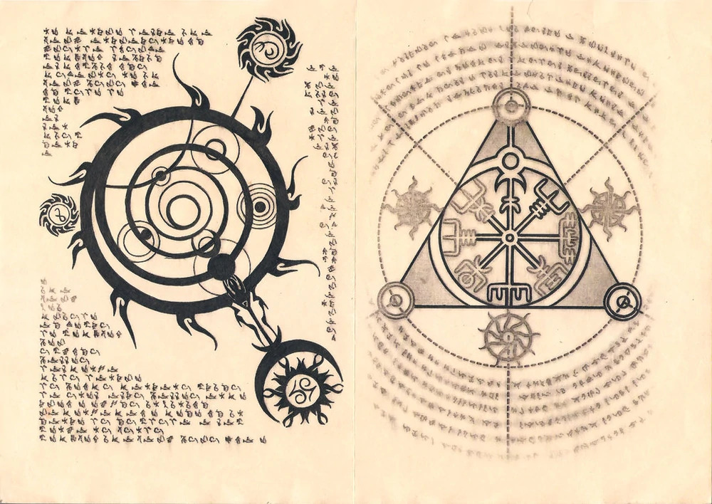
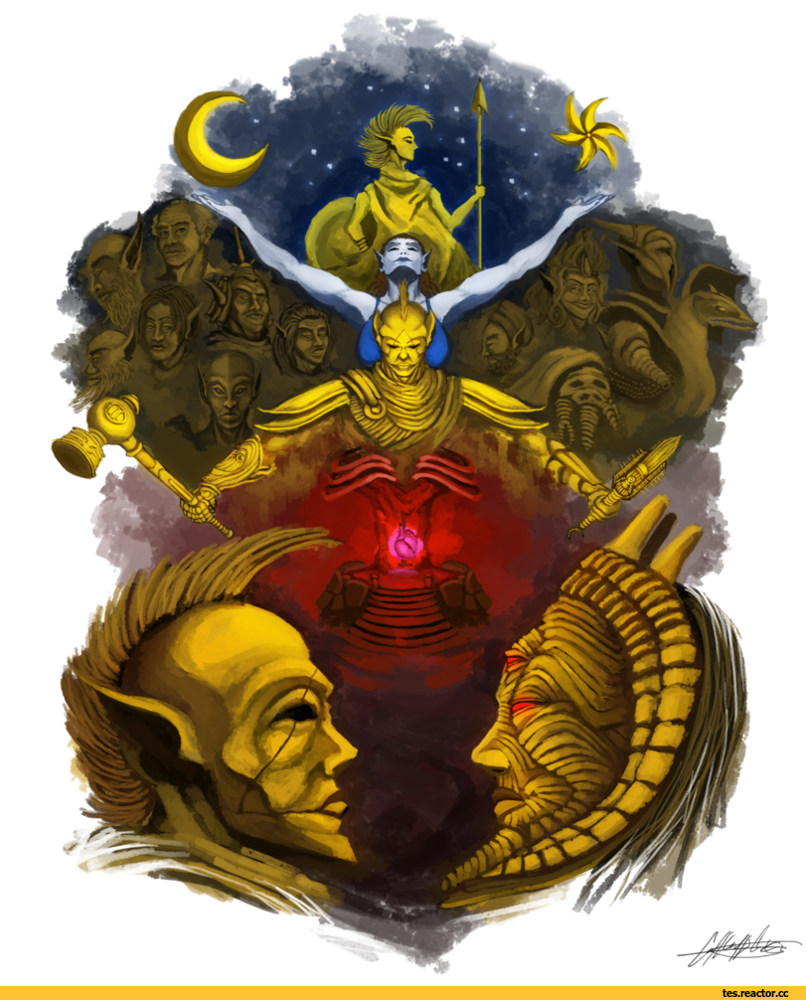
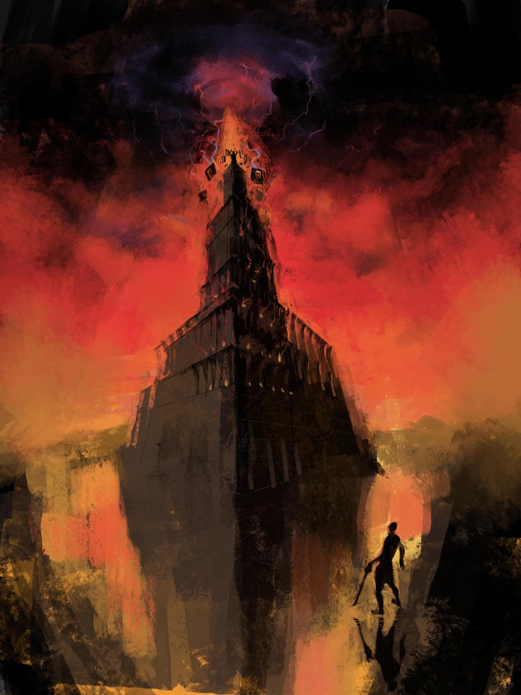
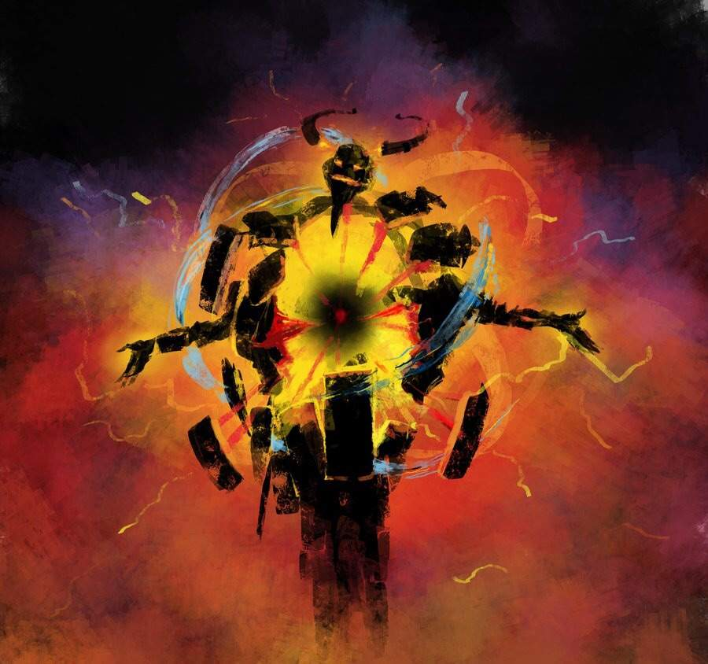
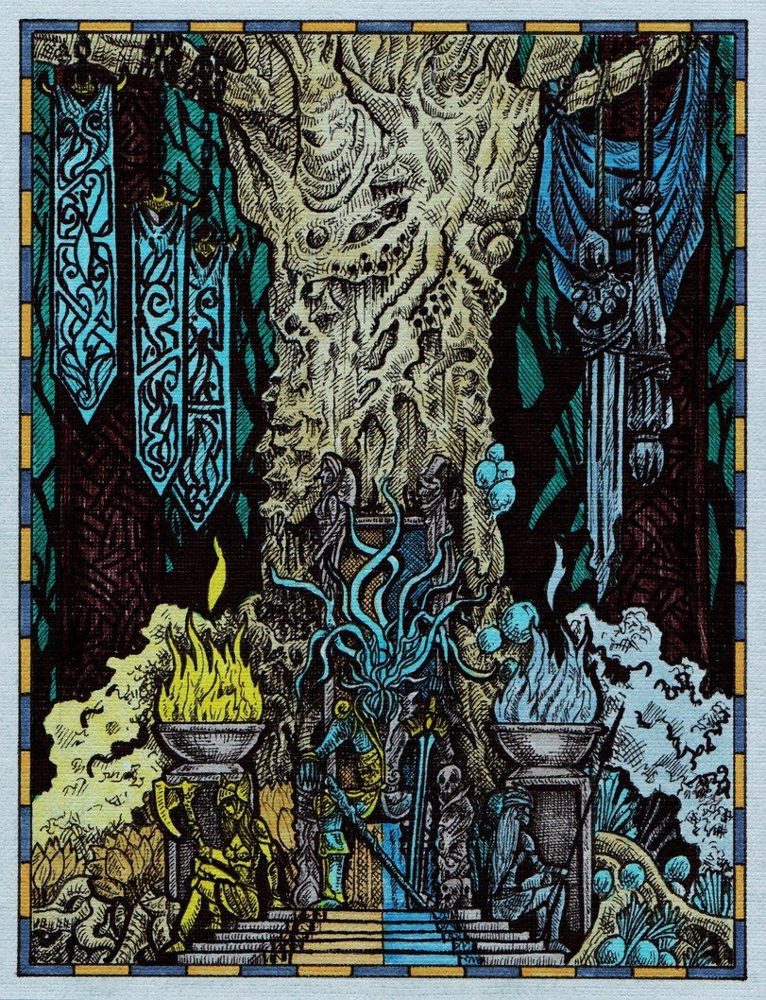

# [上古卷轴：哲学与形而上学](https://vsbattles.fandom.com/wiki/User_blog:Matthew_Schroeder/The_Elder_Scrolls:_Metaphysics_%26_Philosophy)

本文转自vs battle wiki，请点上方链接查看原帖！

> 让吾之火焰吞噬汝
> 
> 并制造一扇秘之门
> 
> 在奥比斯祭坛之上
> 
> 在那吾等之家之中
> 
> 吾等安全并被照料

# 简介

大家好，又见面了。希望你过得顺利。

在我最新的[上古卷轴博客](https://vsbattles.fandom.com/wiki/User_blog:Matthew_Schroeder/The_Elder_Scrolls:_Cosmology_%26_Lore)中，我谈到了背景中大致的宇宙学和Lore，我承诺最终会有一个后续博客，在那里我将讨论该系列中**真正**复杂的、形而上的概念。虽然可能花了一点时间，但这一天终于到来了。

这个博客——以及延伸到整个上古卷轴修订的努力，是我在这个维基中最大和最雄心勃勃的项目。我花了几个月的时间沉浸在这个系列的lore中，阅读了几十篇文章和论坛帖子，听了几个小时漫无边际的播客等等，才有了现在的成果。

起初我这样做是出于一种模糊的好奇心和帮助维基的愿望，但很快我就完全投入到上古卷轴中，出于深刻的、真正的兴趣而阅读和研究它。现在，上古卷轴可能是我最喜欢的虚构宇宙。把这个系列的博客看作是一个激情项目，它超越了我在这个网站的角色。我计划在其他地方发布这个系列，如果需要的话，也可以用其他形式发布。

再次对[Ultima Reality](https://vsbattles.fandom.com/wiki/Message_Wall:Ultima_Reality)表示绝对的感谢，他为帮助我付出了巨大努力（不可估量）使这个博客成为可能。没有他的帮助，这个项目就永远不会离开设计阶段。

说到这里，在我们开始之前，我应该说点别的：

首先，本博客涉及高度复杂的、往往是错综复杂的话题，有时会深入到现实世界的哲学和宗教中去，以便进行比较，更好地解释这里讨论的想法。如果这让你感到不舒服，我建议你去别的地方。第二，本博客希望读者至少对上古卷轴宇宙有一个粗略的了解。至少，在进入这篇博客之前，你应该读过我之前关于上古卷轴、宇宙学与Lore的博客。不要说我没有警告你。

说了这么多，让我们（最后）进入这个话题。

# 神话纪元读本：创世释义和扩展信息

> “最初有一对双生之子：阿努和帕多美。二者进入虚空，时间随即开始。
> 当阿努和帕多美游荡在虚空之时，奈尔在其光明与黑暗的碰撞下被创造出来。阿努和帕多美都为她的美丽而欣喜若惊，但她只爱阿努，帕多美于是在二人的刻薄对待下离开了。
> 
> 奈尔随后怀孕了，但是当她临产时，帕多美又回来了，再次恳述他对她的爱恋。但她告诉他，她只爱阿努，帕多美便愤怒地打了她。然后，阿努回来了，他与帕多美战斗，将他逐出时间之领域之外。奈尔生下了创世之一切，但她不久后就因所受之伤夭折了。阿努悲痛欲绝之下便将自己藏于太阳之后而沉睡。
> 
> 同时，生命在创世所造之十二个世界上诞生繁衍。无数岁月后，帕多美得以重回时间之领域。他看到创世之世界并对之深恶痛绝。他挥舞他的利剑，将十二个世界的联系斩断。阿努又惊醒，他又与帕多美战斗。这场漫长而激烈的鏖战最终以阿努的胜利告终。他认为帕多美已死，便将帕多美的身体遗弃，然后试图将残余的十二个世界整合成一个——奈恩，即泰姆瑞尔的世界——以挽救创世。当他这么做的时候，帕多美给予他心脏致命的一击。阿努与他的兄弟纠缠并和他一同永远坠出时间之领域。“
> 
> \- 神话纪元读本

所以，很多人可能已经看过这个了：神话纪元读本。它构成了上古卷轴宇宙中更深层次的哲学和形而上学的整体基础——如果你已经看过其他与宇宙学上层相关的游戏内的书籍以及以前的博客，你可能会觉得奇怪，它同时对阿努和帕多美进行了人格化，将它们视为人，而不是原始抽象的概念，同时也独有的引入了第三者，奈尔。

这是因为神话纪元读本实际上是一本儿童读物，简化了原始创世神话的叙述。正因如此，许多复杂的细节和形而上的概念被舍弃了，或者只是暗指。这使得它成为我们深入研究上古卷轴宇宙中形而上学的理想之地。

说到这里，让我们来剖析一下这篇文章的内容：

神话纪元读本向我们展示了阿努和帕多美的冲突，这两种对立的力量或存在先于其他任何事物，并导致了第三个实体的产生：奈尔。类似于静止与变化的相互作用是如何创造奥比斯的。然而，接下来的故事发生了分歧：

阿努和帕多美都爱上了奈尔，但她只爱阿努。她怀上了他的孩子，帕多美则因为她的拒绝而被激怒，在她生下万物的时候杀死了她。接着，阿努与帕多美激战并击败了他，并将他的兄弟逐出了时间之外。奈尔在分娩与死亡时的共同哭泣被称为原始哀号，以及，它是已知的创世形式。

现在，接下来发生的事情是**极为**重要的，这将是我们以后要讲的所有内容的基础，所以我们现在必须确立它：
> ”阿努悲痛欲绝之下便将自己藏于太阳之后而沉睡。
> 
> 同时，生命在创世所造之十二个世界上诞生繁衍。无数岁月后，帕多美得以重回时间之领域。
> 
> 阿努又惊醒，他又与帕多美战斗。”

奈尔和帕多美都死了，阿努独自躺在创世之一切中，被悲痛所打击着，躲在太阳之后沉睡。就在这时发生了，生命在创世之一切中涌现，而帕多美回归。阿努惊醒，他们的战斗又开始了。

与神话纪元读本的其余部分一样，这是一个简化的比喻。真正发生的事情要复杂得多。从本质上讲，上古卷轴的整个宇宙——不只是奥比斯，而是整个世界观——都是阿努之梦。不是那个象征着静止的原始体现的阿努，相对于象征着变化的原始体现的帕多美，因为它们也是他梦境的一部分，而是**阿努**，帕多美的兄弟，奈尔的爱人。

这三者，不管他们是什么，在创世之前，存在于原始的虚空中。阿努和奈尔一起试图创造一个全新存在，但是帕多美的干预阻止了它，就在奈尔诞下十二世界的时候。这一系列事件导致阿努达到了一个被称为不凋花的状态，在那里他陷入了沉睡，梦见了一个本应破碎的世界，来反映出他和奈尔会创造出什么。

阿努以阿努的身份出现在这个梦中，静止的体现，而他的兄弟帕多美则是他的对立面，变化的体现。同样地，奈尔是这两个概念相碰相撞的产物——奥比斯(以及，更明显的奈恩和泰姆瑞尔)，位于两个绝对对立面之间的中间可能性。灰色可能性介于阿努的白色区域和帕多美的黑色区域之间。

这就是为什么奥比斯在艾尔诺菲语中的意思是“竞技场”，也是为什么阿努的梦境是一个充满冲突和痛苦的梦：它是一个由死亡、悲伤和哀痛所创造的现实，由那双生子之间冲突的映射所定义。两股原始力量永恒的对立着，为那之间的一切而战。简而言之，阿努的梦是一个充满着悲痛的噩梦。一个我们必须逃离的监狱。

# 对映体：王与反叛者，一与一

既然我们解释了神话纪元读本，并以阿努之梦奠定了形而上学的基础，我们或许应该讨论梦中的一个最重要的特点：对映体。

当然，如果你是一个普通人，你可能会想“对映体到底是什么东西？”

在现实生活中，这个词来自古希腊语，意思是“对立的形式”（enantíos，“对立的” + morphḗ，“形式”）。这是几何学中用来描述对称图像的一个词，对称图像是彼此的镜像，但又不完全相同。在上古卷轴的世界中，这个术语指的是回响于阿努之梦所有层级的宇宙常量。

> “一直到神话纪元读本：
> 
> 奈恩（女性/土地/生-死对映体的自由催化剂）/ 阿努-帕多美（对映体必要的背叛）/？*（屏障者目睹导致失明或致残并从而固化波形；失明/致残= =最终解释）”
> 
> \- Michael Kirkbride

对映体主要是通过阿努和帕多美的相互作用来表达的，奈尔在这两者之间导致了她的死亡和阿努之梦的开始。奈尔的原始哀号，她在分娩和死亡时的哭声，像一首歌一样回荡在整个梦中，这是定义和塑造一切存在的根本音调：

> “泰姆瑞尔。繁星之心。这一切他妈的就是首歌。它要么是由十二行星组成，要么是由两个在子宫中分裂的兄弟组成。无论如何，这都是那原始的哀号，那些伴随着哀号成长的存在——他们不由自主地听到它，然后加入它，或者试图控制它，抑或逃离它。泰姆瑞尔上有音乐的原因在于它的存在。
> 
> 过去是，现在是，将来亦不会停止。其中重复着；演奏着一首名为变化的曲子。”
> 
> \- Michael Kirkbride

对映体一般被认为由三种元素组成——王、反叛者与观察者——并且在一定程度上遵循一个特定的模式：

打个比方，有王和反叛者——两个在镜子里相对的人物。反叛者会背叛他的王，随后的冲突通常会导致其中一人死亡，或者同归于尽。这种相互作用是由一个隐喻性的见证者观察到的，见证者通常会因为此事件导致失明或致残，他决定了两个冲突方中谁是反叛者或王，可以说是“固化波形”。没有见证者，王和反叛者是可以互换的，因为他们之间本质上没有区别，可以很容易地互换位置而保持不变。这一观点在维威克的36课的其11中得到了最好的阐述，它描述了领袖（因多瑞尔·尼瑞瓦/尼瑞瓦因）和萨玛特（沃林·达格斯/达格斯·乌尔）之间的对映体：

> “统治者自顶至踵皆被灿之火甲。其所为之事皆救赎焉。其死乃一还现世之象。此乃其寐之第二义。萨玛特为其代，故汝欲知汝岂无治。
> 
> “领袖与萨玛特，一与一，十一，不雅之数也。何者为重？汝能知其易位矣乎？吾能，故汝需吾也。
> 
> \- 维威克的36课，其十一

尼瑞瓦因和达格斯·乌尔都认为自己是合法的统治者，面对反叛者。只有通过观察者（在本例中是维威克）的观察，才能确定他们的真实身份。没有他，它们就是一与一，即数字十一，看似相同的元素放在一起，没有任何区别。

关于对映体和数字十一的更多信息可以在维威克的36课的其29中找到，它被恰当地称为“数之经”。在这本书中，数字1到36被赋予了与他们各自布道中有关的意义，并且可以相互联系。

http://en.uesp.net/wiki/Morrowind:36_Lessons_of_Vivec,_Sermon_29

1是塔之数，即“我”，而2是对映体之数。11是掌握者之数，即不明的统治者，其乃超越对映体二元性之个体，且无对等者。

你可以很快地观察到，掌握者（11）是由两个塔（1）组成的，它们加在一起形成了对映体（2）。两个对立的镜像被锁定于冲突之中，最终的结果是一个超越上述二元性之存在的出现。

如果你还不相信对映体，并认为我已经深入和过度分析了这些东西，让我给你展示一些对映体的例子：

- 原初对映体阿努 （王）和帕多美（反叛者），奈尔是见证者，结果便是梦境的诞生。
- 阿卡和洛克汗的相互作用。时间和空间之间的相互作用稳定了奥比斯并允许它从混沌中凝固。王和反叛者的身份取决于你的观点，但如果是见证者则是被广泛接受为马格努斯。结果便是梦达斯和泰姆瑞尔的诞生。
- 塔洛斯对映体，由伊斯米尔·武夫哈斯和祖林·阿克图斯扮演王和反叛者，和早髯·希雅提（泰伯·赛普丁）作为见证者。结果是共同组成众魂塔洛斯。
- 阿莱西亚叛乱，在那里，佩里芙（圣阿莱西亚）领导赛洛迪尔的奴隶对抗他们的主人亚利德精灵。佩里芙（与佩林纳尔）是反叛者，无羽者乌玛瑞尔是王，见证者为莫里豪斯。结果是佩林纳尔被撕成碎片，以及佩里芙成为赛洛迪尔的女皇。
- 红山之战，在那里，因多瑞尔·尼瑞瓦率领歧莫大军对抗他们以前的锻莫盟友。尽管对这件事有很多相互矛盾的描述，尼瑞瓦被认为是王，由维威克，索萨·希尔和阿玛莱西娅扮演反叛者，阿兰多·苏作为见证者。结果便是歧莫转变为丹莫，和阿姆希维的诞生。
- 尼瑞瓦因预言。上古卷轴3：晨风的主要事件，尼瑞瓦因为王（领袖），达格斯·乌尔为反叛者（萨玛特），维威克则是见证者。结果是洛克汗之心被毁，阿姆希维的终结。
- 湮灭危机。上古卷轴4：湮灭的主要事件，马丁·赛普丁是王，曼卡尔·卡莫兰是反叛者。有趣的是，赛洛迪尔的勇士（玩家角色）是本事件的见证者。结果是Chim-El-Adabal的毁灭，以及赛洛迪尔帝国的终结。
- 灰色行军，是疯狂魔君谢尔格拉所要面临的周期性灾难，以及秩序魔君杰盖拉格将崛起并推翻谢尔格拉的统治。这是一个对映体，王和反叛者实际上是同一存在。但见证者是谁有待商榷。

这只是存在于上古卷轴Lore中众多对映体中的一小部分。正如你所看到的，这并不是疯狂的粉丝们凭空捏造出来的无聊理论，而是整个系列中一个很容易辨别的模式。

# 阿卡与洛克汗：神圣的相互作用

既然我们已经确定了上古卷轴宇宙的基本二元性，现在是时候继续讨论该系列lore中最容易被误解的两个人物，以及他们彼此之间的内在联系。阿卡和洛克汗，时间龙神和缺位空间神

为了理解他们之间的关系和联系，我们有必要确立一个概念：在上古卷轴的背景中，所有事物都始于定义宇宙的原始二元碰撞，也就是创造奥比斯的 静止/一切 和 变化/无之间的相互作用。这种相互作用甚至在凡世中继续回响着，就像人类和精灵、及其他们之间的分裂。

> 所有泰姆瑞尔的宗教都有着相同的起源。无论人类或者精灵，还有其他一切事物都源自于双生之原力——有人称它们为阿努和帕多美。这两种力量有很多名字：有的时候，它们为阿努埃尔-西帝斯，又或者是阿克-埃尔抑或萨塔克-阿克尔、是-非
> 
> \- 元神话

然而，为了进一步深入研究形而上学，我们需要完全颠覆这一概念，将其视为虚幻。这是因为在上古卷轴宇宙中，二元性和分离的概念是没有意义的幻觉，因为所有的一切都是神源阿努的梦，他存在于纯粹的统一之中，没有第二面。对映体的概念强化了这一观点，正如在宇宙中的神圣数字学：

> 当我坐在这个完美的花园里时，我在思考那些我们认为是吉祥的、对宇宙的存在至关重要的神圣之数。
> 
> 三是主要天体的数字，体现在太阳和双月上。它也是我完美的女儿们的数字，这就是为什么我们不会产生其他的继承人。
> 
> 五是元素之数，因为现实由土、空气、水、火和以太组成。这也是我在任何时候在书桌上打开的书的数量。
> 
> 八是行星之数，也是三加五的总和。八也是我与我的哲学协会成员喝杯葛萨姆黄褐色葡萄酒时的限制——不多也不少。
> 
> 这些都是好数字。而好数字的总和，我们称之为十六，确实是一个非常强大的数字。
> 
> 不过，我们必须谨防坏数字，因为二缺乏远见，试图展现二元性，而我们都知道这是不可能的。
> 
> \- 对神圣之数的思考

阿努和帕多美遵循这一原则，因为它们实际上是一种没有区别或双重性质的单一力量，被渺小的存在视为两种独立的力量，这一点在尤库达万物之神萨塔卡尔身上得到了明确的体现，萨塔卡尔是一条无限之巨蛇，它将萨塔克（阿努）和阿克尔（帕多美）视其为身体的一部分。因此，说明所有的二元概念就像一枚硬币的两面，一面白，一面黑，而不是两枚不同的硬币。

> 奈恩的第二面，乃接踵而至的雏形奈恩（Nirn-Ensuing）。预见世界到来的思想形态：即“泰姆瑞尔之终（Tamriel Final）”。阿努凡纳希（Anuvanna'si）。唯索萨·希尔知其形。其本质于时间形成之前便被遗忘——即阿努为了智慧而自我毁灭之时。我辈愚钝之徒知本源有二状：阿努与帕多美，然此二元没有任何价值。此乃洛克汗之弥天大谎，意在将我等自阿努完整之真理中分离。吾父索萨·希尔向我等揭开真相：帕多美并不存在。帕多美乃价值之缺失。乃乏。乃见光即灭之幽灵。乃无。唯有阿努是存在的。阿努被割裂，也因此得了诸多名，有了诸多面相。独一无二。
> 
> \- 次序真理，第一卷
> 
> "爱人是那至高之国及其一系列信仰。他既纯粹一体的圣城。荒芜的怪物之地乃其规则。此点由阿努与其之第二面明确证明，爱知道这一点从未真正发生。"
> 
> \- 维威克的36课，其三十五

它们的灵魂，阿努·埃尔和西帝斯，分别是存在和不存在（是和非）的体现，也遵循这一原则，尽管更加微妙。由于所有的东西都是神源之梦，存在本身可以说是虚假的，是一片虚幻的土地，没有任何东西真正存在。因此，是（存在）非（并不真正存在）。

现在，究竟是什么造成了这种二元性的幻觉？时间和空间的概念。

通过时间，事物获得了一种前进和连续性的感觉，众生可以在过去、现在和未来对自己有不同的感知。通过空间，事物获得了形态和空间感，众生可以感知到自己与周围环境的分离。

次序真理中通过反复提到 “洛克汗弥天大谎 ”和“这条组装不当的龙所吐纳的干瘪的名为“杂多异质”的谎言"来说明这一概念：

> 索萨·希尔之意志乃是与时间对称的意志。无名之意志。何谓“名”？ 神圣节拍器告诉我等，“名”是将那大大小小的齿轮撬开的楔子。洛克汗弥天大谎的残留物松开轮链并腐蚀框架。艾·阿达齿轮则以彼等之法命名万事万物。愚钝之辈认为这是一种善意，而永远上弦的主发条称之为诅咒——一种根植于自私自负中的诅咒。命名即是将一个与另一个分开，这便代表着阿努聚合（Anuic convergence）之死，以及存续奈恩（Nirn-Ensuing）——这条组装不当的龙所吐纳的干瘪的名为“杂多异质”的谎言。
>
> \- 次序真理，第二卷

现在你看到了，注意到这两个概念之间的联系是**极其**重要的，这两个概念分别由直接从阿努·埃尔和西帝斯中诞生出来的艾·阿达所体现，也是本节的主要主题。阿卡和洛克汗

> 正如奥比斯之元神话所记载的那样，时间龙神阿卡在摧毁自身后创造了其名，成为弥漫于奥比斯的血液，让曾经无限与永恒的艾·阿达从不可言喻中爆发出来，并承认自己是有过去和未来的独立存在：
> 
> 起初，奥比斯混乱迷茫，因阿努埃尔在混乱无序地沉思中行进着。奥比斯的各个方面都需要遵循一个秩序或规律，借此，他们可能在完美的知识之外享受一点时间。所以他也可能以这种方式认知自我，阿努再塑奥瑞埃尔，其灵魂之魂。奥瑞埃尔穿过奥比斯播下新的伟力，称为时间。随着时间的推移，从奥比斯的各个方面开始理解他们的本质和其局限性。他们有了名字，比如马格努斯，玛拉或者禅（Xen）。其中一个，洛克汗，比其本质更加局限，因此他在任何地方都不可久留。
> 
> \- 元神话：世界之心

然而，只看傲特莫的元神话是从有限的角度来认识事物。在深入研究与此相关的晦涩的形而上学时，你需要记住，由于二元性并不真正存在，阿卡和洛克汗实际上是同一存在，是以相反的对立面来反映他们二分法的镜像，就像你在镜子里的倒影总是和你做同样的事情，但角度相反。

考虑到这一点，重要的是要注意，在时间被创造之前，洛克汗实际上是“首个”获得自我的艾·阿达。他看到奥比斯的混沌被原始的灵魂们塑造和重塑，并希望既不属于它又属于它，作为一个被变化所驱使的帕多美性质的存在，他来到奥比斯之外，在万物的边界。接着回望，他看到奥比斯之轮的侧面是塔，是上帝的真名。我（I）。

在这一刻，洛克汗意识到他并不是真实的，而只是那神源阿努之梦中的一个静态形象，被困在一个所有人都应该逃离的痛苦监狱中。

> 阿努之长子，因其无比渴望秩序，时间，随之而来的是阿卡托什。帕赫姆之长子从一开始就四处游荡，于游走中突变，且无名，但被打上洛克汗之名。随着时间的推移，越来越多的形态有了自我，洛克汗看着奥比斯塑造的过程，并对每一次新的塑形既高兴又厌倦。当奥比斯的诸神和恶魔爆发式的诞生时，帕赫姆试图把这一切都抛在脑后，因为他想要这一切，但又不是马上就想得到这一切。就在那时，他来到了奥比斯的边界。
> 
> 他看到了塔，因为一个侧向的环是一个"I"。这是洛克汗的第一个词，他永远，永远不会忘记。
> 
> \- 维克的教导

因此，洛克汗与奥比斯本身融为一体，用空间的概念来稳定它，并成为"圣甲虫"，即包围竞技场的外壳，同时作为其框架。这个图案象征着洛克汗的目标：由于圣甲虫——蜣螂——在古埃及被认为是翻新和生命从腐烂中重生的象征，洛克汗的计划完美地反映了这一点，一个新的梦者从充满腐败和痛苦的可怕梦境的深处中诞生。

> 维威克谓之于领袖，若悟世之奥义，须谨记波耶希亚之言：
> 
> 格之制者，圣之甲虫，我等向君誓：一世使吾爱君，一垢被使吾惜。于君不审之时为尔祖叛矣。迂者马格努斯有妄言，然此言不可动不化者。此一常足之计也。塔之须臾之时，道上之赦，此为何也？若非君目下之火，此为何也？
> 
> \- 维威克的36课，其十
>
> 背弃誓言之人要小心了，因为他们的那些叛徒奔过nymic之路，是那群烦人众神的走狗。龙之血将升天并藏于六千年的光界迷宫之中，这就是竞技场，而他们却仍然否认这誓言。以书为证，拿着这把钥匙，并刺破这包裹承接衣钵者的神圣外壳！黄金之肤！Scarab ae aurbex（圣甲虫即奥比斯）！
> 
> \- 沙克斯秘典注解，第三册

同样重要的是要注意到，圣甲虫符号不仅与洛克汗的目标有关，而且还与赛伊克的企图、梅法拉、波耶西亚和阿祖拉的教义有关，基于空间神本身的意识形态。它的使用原理是通过苦修和服从来实现神化和超越奥比斯的界限——维威克在他的36课其三十二中详细描述了这一点，他说通过服从迪德拉的折磨，丹莫可以约束自我并达成神性，甚至将前者描述为狱卒、钥匙和锁，因为他们是封锁凡人世界之轮的一部分，但在他们的行为中包含着赋予自由的潜力。

> 此锤之经也，其一：
> 
> “灭之乐，乃消于虚幻之乐也。凡欲战眠世之人皆求而入此行焉。裂解二元有异，吾以一锤责之。”
> 
> 其二：
> 
> “以吾为鉴，身为凡人须受此戒。狱卒以此待汝如泥塑汝身。此魔族之锁钥。汝以为彼等缘何回避和解？”
> 
> 其三：
> 
> “呜呼，维罗斯之众，汝之肌肤已饱含暗黑。吾之忧思致斯攸毕。且记波耶希亚使汝等成瘀伤之色。否则，何以示汝远行之重。痛可乎？”
> 
> 其四：
> 
> “圣者非砧。此老生常谈，仅此而已。吾之所谓乃死，第四登天法也。”
> 
> 其五：
> 
> “美德之正解：深谋远虑以为诛。”
> 
> 其六：
> 
> “劳筋骨、苦心智，折磨如鼓击绵绵不绝。汝如一质，自苦中脱，当自喜也。此亦使其尝己之伤。鼓裂，汝乃觉其为群蜂，亦或曰：汝之眠毕矣。”

这又与古埃及的圣甲虫图案完美契合。由于昆虫在粪球内孕育的幼虫会需要食物的参与而诞生，使它们能够从一堆腐烂的东西中活着出来，因此埃及人会将它们与生命的出现以及死亡和重生的永恒循环联系起来。现在，将这一点与上文描述的丹莫的哲学相比较。

总之，回到主要话题。当洛克汗通过孕育空间的概念和成为圣甲虫来稳定奥比斯的时候，发生了他由塔所诱发的顿悟相反的反应：龙神阿卡也意识到他在阿努的梦中的存在是如此短暂且微不足道的事实，但他选择否认这一事实，宣称他自己是存在的个体，而不仅仅是一个精神分裂的神源梦中的形象，通过这一点，他打碎了自身，并化作时间概念流过奥比斯，允许事物有一个连续的假象，根据他自己的阿努性质，和个体/分离。

这就是为什么时间龙神拥有这么多不同的名字。阿卡托什、奥瑞·埃尔、阿尔科什、奥杜因等在文化差异下并不是同一个存在，而是一个更大的实体的碎片，即阿卡，最初的时间之神。

> 伊德拉斯阿卡，他有如此之多的名字，也许已经暗示了我即将提交给记忆孢子的内容，他完全疯了。他的思想在他“从永恒中栖息的那一天”时崩溃而又破碎了，而我们所有奥比斯上的存在都在其碎片上生存着，被卷入由他通过说 "我存在 "而产生的既无缘由且一时兴起的时间撰写和抹除中。在随后自以太雷鸣般的自我掌声中（不，是涟漪，直至惯例，即忘却），时间之神会憎恨在奥比斯另一端的同胞，空间之神，这有什么奇怪的呢？任何造物都会因为对一个单一的词的恐惧而变得如此彻底危险："我不存在"？
> 
> \- 艾·阿达，八大伊德拉，吃掉梦者

阿卡和洛克汗是他们的先祖所代表的回响，这决定了他们的理念和行动。阿卡是一个由静止定义的阿努性质的魂灵，他来自阿努和阿努·埃尔的是，因此，他坚定地表示，他是真实存在的个体，而不是一个精神分裂的神源梦中的不存在的形象（我存在）。因此，他试图通过时间的概念来维护和保持奥比斯的原貌，甚至被描述为一个始终满足的存在。

在硬币的另一面，洛克汗是一个由变化定义的帕多美性质的魂灵，他来自帕多美和西帝斯的非，在看到奥比斯之轮侧面的塔后，意识到他并不是真正的真实，一切都只是一个没有任何内在实质的短暂的梦（我不存在）。因此，他寻求实现终极的变革行动：摧毁奥比斯，最终创造一个通过爱形成的崭新梦境，而不是像现在这样通过暴力和仇恨创造的噩梦。

然而，洛克汗意识到，这种努力只能通过自我反思自己在神源之梦的范围内的渺小来实现，由于这些原始之魂们无限且完美，他们在目前的状态下永远无法实现它。因此，他们需要被限制，成为凡人而不是神。正是这种认知导致了梦达斯——凡人位面的诞生。

为了创造它，洛克汗要求艾·阿达分裂自我，裂解他们无限的"躯体"以进入凡世并被困在里面。当然，艾·阿达不愿意失去他们自身的无限性，所以洛克汗转而诉诸于操纵，通过诡计、智慧和武力说服艾·阿达遵循他的计划。

跟随洛克汗计划的艾·阿达在力量和层级上都被大大削弱了，被局限于他们所创造的梦达斯的枷锁中。其中最强大的魂灵们保留下了他们的神性，成为伊德拉，而最弱的将成为艾尔诺菲，所有凡人的祖先。

阿卡（现在是作为其碎片的奥瑞·埃尔）会因为洛克汗的背叛而暴怒，并召集一支力量来对付他。然而，有些魂灵站在洛克汗这边，两者进行了明显的隐喻之战。站在奥瑞-埃尔一边的艾尔诺菲将生下第一批精灵，而站在洛克汗一边的则生下第一批人类。最终，伊德拉取得了胜利，洛克汗的心脏被挖出，他的身体被撕碎，其腐烂的碎片留在天空中，成为双月

由于他们各自的艾尔诺菲先祖在这场战争的对立面作战，人类和精灵对洛克汗和凡世拥有不同的观点。大多数人类文化都尊崇洛克汗为造物主之神和人类之父，将凡世的造物视为一种赐福。同时，大多数精灵文化（尤其是傲特莫）将梦达斯视为肉体的牢笼，并因此将洛克汗斥为诡计多端的魔鬼，一个将他们的灵魂困于虚假存在中的恶魔。

归根结底，两种解释都不完全正确或错误。通过梦达斯，洛克汗试图创造一个超越性的试炼场，一个灵魂最容易遭受变化和痛苦的竞技场——因此也是他们有朝一日逃离梦境这个监狱的完美环境。

> 洛克汗是奈恩之魂，是所有凡人的神。但这并不意味着所有凡人都一定喜欢他，甚至认识他。大多数精灵憎恨他，认为创世是将他们与灵魂领域分开的行为。大多数人类崇敬他，或他的某些方面，作为存在的预示。凡间的造物，梦达斯，奈恩，是所有生灵灵魂痛苦的来源；所有的灵魂都深知他们最初来自其他地方，而奈恩是通往下一步的残酷而关键的一步。这个下一步是什么？有些人希望回到最初的状态，即灵魂领域，而洛克汗是阻碍他们前进的恶魔；对他们来说，奈恩是一座监狱，是要逃离的幻象。其他人认为洛克汗汗创造了这个世界作为超越性的试炼场；对他们来说，灵魂领域已经是一座监狱，真正的逃脱现在终于变得可能了。
> 
> \- 奈恩之魂，凡人之神

在泰姆瑞尔的所有种族中，只有晨风的丹莫真正理解这一点。由于圣维洛斯的赛伊克的企图和活神维威克的著作，他们把凡间看作是巨大痛苦的试验场，只有服从于洛克汗设定的折磨，他们才可能实现神化并战胜这种存在。这种理解最终将使他们与竞技场的其他灵魂区分开来。

# 囚犯：解放世界的英雄

在上古卷轴系列中，众所周知，玩家角色开始时往往是一个没有任何背景的囚犯。自竞技场以来，这几乎是每个游戏都会出现的元素，唯一的例外是战斗尖塔和红卫等衍生游戏。这样做通常是为了让玩家自己能够创造属于他们的历史并沉浸在游戏的世界中，将其定义为自己的个人叙事。正如陶德·霍华德喜欢说的那样：

> “去你想去的地方！做你想做的角色！”

然而，与许多人的想法不同，这并不只是因为贝塞斯达的懒惰和对监狱有某种癖好而使用的一种便利，恰恰相反。事实上，“囚犯"是一个宇宙常量，它贯穿了整个神源之梦。

索萨·希尔在上古卷轴Online中的对话可能是最直接的迹象，表明囚犯是一个拥有强大力量的宇宙常量，这位发条神甚至表示，囚犯摆脱了决定性的命运和因果本身，因此能够做出自己的选择。

> 索萨·希尔：囚犯拥有强大的力量，使隐喻成为现实。我们在结束前会需要你。
> 
> 无魂者：你为什么一直叫我囚犯？
> 
> 索萨·希尔：也许是一个愚人的希望。我应该解释一下。
> 
> 看看你周围。这一切的存在是因为它必须存在。我站在这里，在这个地方，在这个时刻，不是因为我希望如此，而是因为我必须如此。一种行为和必然的结果。
> 
> 无魂者：那么这不是让你成为了囚犯吗？
> 
> 索萨·希尔：聪明...但不正确。
> 
> 囚犯必须领悟两个关键性的洞察力。首先，他们必须面对自己被监禁的现实本身。他们必须看到决定性的墙壁——将他们束缚在自己的道路上的因果关系链。
> 
> 无魂者：你还没有做到这一点吗？
> 
> 索萨·希尔：我有。但我还没有达到第二个洞察力。
> 
> 囚犯必须看到他们监牢的门。他们必须透过铁栅栏，察觉到超越因果关系的存在。超越时间。只有这样，他们才能逃离出来。
> 
> 无魂者：你没有看到门？
> 
> 索萨·希尔：我只看到不稳定的墙壁。
> 
> 如果泰姆瑞尔的人们必须存在于这个监牢里，那么。我将确保墙壁的稳定，缝隙的密封，所有留在里面的人都是安全的。
> 
> 无魂者：我没有其他问题了。
> 
> 索萨·希尔：我见过的像你这样的英雄很少。非常少。我把三位一体的事情揽在自己身上，但事实上，你可能是拯救我们的人。解放世界的囚犯。我们将拭目以待。
> 
> 后会有期。

在上古卷轴Online中也可以找到这种想法的其他迹象，先知和AI（OS），一个读过上古卷轴的先祖圣蛾先知和一个管理发条城的A.I（Automata Incarnum）分别表示，无魂者是时间结构的一个伤痕，存在于所有可能性之外。

> AIOS：开始实体分析。实体存在于已知的可能点之外。正在过渡到常规接收阵列。
> 
> 你好。
> 
> 先知：很高兴再次见到你。我确实看到了你，以我自己的方式。你是时间的一个伤痕，是现实中的一道裂缝，它不应该存在，也不能长久地存在下去。

然而，这个概念并不是上古卷轴Online的全新设计，而是自上古卷轴3：晨风以来一直存在于该系列中的一贯想法。首先，请阅读游戏中展示的以下尼瑞瓦因预言，并注意这两个预言是如何强调天选英雄是一个未知者，出生在不确定的星座和未知的父母下。
> "在某一天与不确定的父母下
> 
> 将以星与月的化身再次重生。
> 
> 枯萎与衰老皆无法伤害于他。
> 
> 肉体上的诅咒在他面前飞舞。
> 
> 阿祖拉之眼于黑暗之穴中看
> 
> 并使得那星与月无比之耀眼。
> 
> 未知之声将使各个家族联合。
> 
> 审判三席共同称呼他为领袖。
> 
> 未知之手将使维洛西人联合。
> 
> 四大部族称呼他为尼瑞瓦因。"
> 
> \- 七大幻象
> 
> "当大地碎裂，天空染成窒息的黑色时。
> 
> 沉睡之人奉上七种诅咒。
> 
> 炉灶旁来了一个未知者。
> 
> 在星与月之下进行远行。
> 
> 虽说生死未卜，但其命运已定。
> 
> 他的形象标志着他的命运。
> 
> 恶人跟踪他，义人咒骂他。
> 
> 先知们诉说，但皆不承认。
> 
> 众多考验使之明白
> 
> 未知者的命运，咒诅的祸害。
> 
> 无数人试金石般试探未知者。
> 
> 无数人跌倒，只有一人留下。"
> 
> \- 未知者

这可能看起来没有什么证据，所以接下来让我们看看维威克的36课。它们也预言了尼瑞瓦因的到来，将领袖称为统治者。

> “统治者须立于吾前，反吾。须得诫于吾之罚。吾欲使之知。彼可男可女。吾为其必得之形也。
> 
> “统治者若于他人之身见其类，其必不可御一物也。”
> 
> \- 维威克的36课，其十三
> 
> 你已发现维威克的第三十七布道，此乃光之弯曲，早已超过领袖之史，其戴着不确定之面孔，无论如何都将统治，直到末世降至。
> 
> \- 维威克的36课，其三十七

第一段话说，尼瑞瓦因会以男性或女性的身份出现，第二段话说，尼瑞瓦因有着不固定的面孔，不管他们会如何统治。

这些引文提到了尼瑞瓦因——作为玩家角色的种族、性别、外表和行为都是由玩家自愿决定的，而不是由预定的程序决定的。在C0DA前传中可以找到一个更明显的例子，即陆沉：第一天，尼瑞瓦因实际上是一个没有形体的、多种族的人，在几种形态之间进行量子振动：
> 图片1：透过裂缝，阿库拉可汗的巨大身躯俯视着我们所有人，眼中流露出难以理解的希望。它的第三只眼睛是睁开的，上面有一个勉强可以辨认的尼瑞瓦因的头作为它的驾驶者，性别和种族不明，或者，如果你愿意这样想象：只是"量子振动"的速度太快，无法辨别。
> 
> \- 陆沉：第一天

但也有其他东西在起作用。回头看看索萨·希尔之前的那句话：
> “这一切的存在是因为它必须存在。我站在这里，在这个地方，在这个时刻，不是因为我希望如此，而是因为我必须如此。一种行为和必然的结果。
>
> (...)
> 
> 囚犯必须领悟两个关键性的洞察力。首先，他们必须面对自己被监禁的现实本身。他们必须看到决定性的墙壁——将他们束缚在自己的道路上的因果关系链。
> 
> (...)
> 
> 囚犯必须看到他们监牢的门。他们必须透过铁栅栏，察觉到超越因果关系的存在。超越时间。只有这样，他们才能逃离出来。”

如前所述，上古卷轴的宇宙是神源所梦出的监狱，其中的所有存在都是神源无边意识的造物及其体现。因此，他们没有自己真正的自由意志，因为他们所有的想法和行为都是由梦者设定好的因果关系及其结果所决定的。

囚犯是这个规则下的例外。他们能够感知到包围着他们的监狱的真相，看到束缚他们的枷锁。此外，囚犯可以看到他们监牢的门，并通过它看到外面的东西，超越时间和决定性的因果关系：自由。

> ”当然，除非有一个漏洞。比如说，像一个叫都瓦克因的人碰巧出现…“在不确定的星座下出生，父母也不确定”。（一旁的额外信息：奥比斯中是什么造就囚犯这样如此强大的神话人物？）”
> 
> \- Michael Kirkbride
 
这就是为什么尼瑞瓦因是在不确定的星座下由未知的父母所生，而且是任何性别和任何种族。这就是为什么无魂者是现实中的一道裂缝，存在于可能性之外。因为作为囚犯，他们不属于神源那决定性意志中，能够为自己做出选择。

# 音调魔法：承接神话的衣钵

先从梦境的复杂形而上学中休息一下，对映体和洛克汗，让我们谈谈这个博客中探讨的最简单的概念：披甲。

在上古卷轴中，现实本身是由共鸣组成的，这些音调作为奈尔的原始哀号的映射而存在，并作为阿努和帕多美之间的歌声、灰色可能性弥漫在整个梦境中。这些音调可以被操纵、重塑和建模，以改变现实本身，这就是所谓的音调构造，这种做法主要为锻莫所知，他们被大量暗示为能够以某种方式"听到"原始哀号的种族之一，因此对塑造映射它的音调有一种本性的冲动。

这种行为的另一个名称是 "神话能量"，它描述了重塑弥漫在梦达斯和奥比斯中的神话力量和原型的艺术。最著名的例子是锻莫制造了由固体声音组成的金属，这些金属不会生锈，也不会腐化，还有卡格瑞纳克的工具被用来为洛克汗之心形成一个物理外壳，亚格鲁姆·巴加恩直言不讳地指出，创造上述工具是为了制造 "神话能量魔法"——这也有助于确定洛克汗之心没有被摧毁，只是从其物理形态中释放出来。

然而，音调的操纵并不仅仅是为了创造不生锈的金属和在局部范围内扭曲现实。它最强大和最荒谬的变体被称为舞动之塔，这是一种极其困难的尝试，即在与奥比斯乐曲同步的情况下"舞动"，并通过这种方式挖掘其力量，以便在很大程度上操纵现实，足以重塑诸神本身及其本质。

> 正如飞蛾眼所预言的那样，亚利德的傲慢将结出苦果。他们在高处眺望世界，却没有注意到他们脚下强压怒火的尼德人，直到奴隶们站起来夺走他们的塔。Chim-el-Adabal也被他们夺去了，但在大法师阿努玛瑞尔创造八节塔杖之前，每一节都是其舞蹈中的一个塔的模样。接着，其中的七节被白金骑士带到了遥远的折叠空间，在那里被藏匿起来。
> 
> （可以肯定的是这一切都不为佩林·埃尔·埃西亚所知，否则可能会有不同的八位神祇！）。
> 
> \- 奥比斯之谜4
> 
> 这就是玛鲁卡提受选者，为了将赛洛迪尔的时间龙神阿卡托什与他的精灵族对应者奥瑞·埃尔分开而制定的。在白金塔顶上起舞时，他们可以达到一种与由洛克汗之塔诱发的顿悟所回荡的状态，通过这种方式，他们分裂了时间之神，导致黎明纪元的回归，这一事件被称为纪中黎明。
> 
> 阿莱西亚教团的学者——牧师们篡改了时间龙神。
> 
> 阿莱西亚教团的一个狂热教派——玛鲁卡提受选者，对仍存在于八神教神学体系中的古老神州传统感到沮丧。具体来说，他们憎恨任何承认阿卡托什，至高无上之魂，无可争议地也是奥瑞埃尔，精灵族的至高神。
> 
> 新发明的仪式被用来反驳这一理论，但无济于事。最后，玛鲁卡提受选者的秘密大师们通过奥比斯本身的渠道，神话般地消除了他们不赞成的龙神的那些方面。一根杖或塔出现在他们面前。秘密大师们在上面起舞，直到它蠕动和颤抖并说出它的原形。
> 
> 塔分裂成八段，时间崩裂。黎明时代的非线性又回来了。
> 
> \- 龙破之时你在何方？（Michael Kirkbride的游戏外版本）
> 
> 尽管所有给定的凹陷，或奥比斯外壳内的鞘，都必然被奥比斯所包含，但真正的提升，通过调用米莫丽，可以将一个确定的鞘从外壳分离出来。在与孤星的交往中，祈求者阿莱西亚进行了思想机关翻转，这是对掷物盘的运用，再现了一个侧向旋转的环是一座塔的真理。通过同样的真理，将包裹的鞘扭曲进中间的黎明（至十七这个数时），会将其带至无时无空。
> 
>当然，可能性预言了轮回之力耗尽后的重新吸收，但期间的缺失甚至可能使可能发生的事件失去意义。
>
> \- 论外壳之鞘的分离

维威克在他的审判中也提到了舞动之塔。然而，他并没有在一个神话般的塔中来塑造梦达斯。相反，他在洛克汗见证的塔中舞动来塑造奥比斯本身，挖掘出CHIM。

>维威克: 现在，我踩着你而上，双月，终于在你的塔上起舞！

> \- 维威克的审判

不过，音调的诡计并不仅仅是通过力量和机械般的过程发生的，梦达斯的居民的集体感知和信仰也可以重塑整个多元宇宙，并铸造他们自己的神话能量魔法。这种神话操纵的现象催生了一些神灵，如空间之神洛克汗的诺德形象舒尔，以及被提升到流氓位面的凯吉特盗贼巴安·达尔。

现在我们为本节建立了一个坚实的基础，我们现在将进入主要议题。究竟什么是披甲？

令人惊讶的是，要解释这个概念，首先需要引用圣经中的一段话：

> 当主要用旋风把以利亚带到天上去的时候，以利亚和以利沙正从吉甲赶来。
> 
> 以利亚对以利沙说："你留在这里，主已经派我到伯特利去了。"
> 
> 但以利沙说："主活着，你也活着，我必不离开你。" 于是他们就下到伯特利去了。
> 
> 在伯特利的先知连队出来问以利沙："你知道耶和华今天要把你的主人从你这里带走吗？"
> 
> "是的，我知道，"以利沙回答说，"所以请安静。"
> 
> 然后以利亚对他说："以利沙，你留在这里，主已经派我去耶利哥了。"
> 
> 他回答说："只要主活着，你也活着，我就不会离开你。" 于是他们去了耶利哥。
> 
> 在耶利哥的先知连队上前问以利沙说："你知道主今天要把你的主人从你那里带走吗？"
> 
> "是的，我知道，"他回答说，"所以要安静。"
> 
> 然后以利亚对他说："你留在这里，主已经派我到约旦河去了。"
> 
> 他回答说："只要主活着，你也活着，我就不离开你。" 于是，他们两个人继续走下去。
> 
> 先知们的五十个人去了，站在远处，面对着以利亚和以利沙在约旦河边停下来的地方。8以利亚拿起他的斗篷，卷起来，用它击打水面。水就向左右分开，他们两个人就在干地上过了河。
> 
> 他们过了河，以利亚对以利沙说："告诉我，在我被带离你之前，我能为你做什么？"
> 
> "让我继承你双重的灵魂，"以利沙回答。
> 
> "你所求的是一件难事，"以利亚说，"然而，如果在我被带走的时候，你看到我，它将是你的——否则，它将不是。"
> 
> 当他们在一起行走和交谈时，突然出现了一辆火焰战车和火马，将他们两人分开，以利亚在旋风中上了天。
> 
> 以利沙看到这一幕，喊道："我父亲！我的父亲！以色列的战车和骑兵！" 以利沙就不再看见他了。然后他抓住他的衣服，把它撕成两半。
> 
> 以利沙就捡起以利亚身上掉下来的衣裳，回去站在约旦河岸上。
> 
> 他拿着从以利亚身上掉下来的幔子，用它敲打水面。"他问："以利亚的神，耶和华现在在哪里？当他敲击水面时，水面向右和向左分开，他就渡过了。
> 
> 从耶利哥来的先知们，在一旁观看，说："以利亚的灵在以利沙身上安息"。他们就去迎接他，在他面前俯伏在地。

在这段经文中，当他即将被一辆火焰马车带到天堂时，以利亚将他的衣钵传给了他的弟子以利沙，象征着他将自己作为以色列神的先知的角色传给了他。看到这一点，来自耶利哥的先知们开始声称以利亚的灵魂现在停留在以利沙身上。

从本质上讲，披甲是一种隐喻性的行为，即继承在上古卷轴历史上具有一定重要性的不存在的神话人物的衣钵，从而变得与上述人物毫无区别，最终成为他们。这样的事件要么是通过继承某个人的角色发生，要么是通过预言或神话事件（重新）制定它。无论哪种方式，披甲的最终结果是你的Nymic音调，构成你的本质，被改写，无论是社会的神话影响，还是现实本身的被动干预。

恰如其分的是，维威克的36课将披甲描述为第三条登神之道，通过它可以升华到神性，并逃离梦的牢笼，它由社会的集体疯狂和歇斯底里组成，有智慧的人可以探索它，以便在不破坏任何系统的情况下用另一个法则取代它，即使结果是不连贯的，也可以说他们是在同一方法中运转。

> “天道之三可探疯狂而无惧。狂者竭力之行乃世之本，而惟始于其书之也。智者可以一法代一法，虽支离破碎，犹可言己以一法行事。此真言也，凡经亦然。”
> 
> \- 维威克的36课，其二十七

另一件进一步支持这一概念的事情是Michael Kirkbride的一个声明，它解释说披甲是一种在取代某个人方面如此特别的行为，以至于没有人记得你一直以来根本不是那个人。
 
> "很多东西都是物体。我们需要一些限制来定义我们的探索，然后再去狂欢。在其根源上，你可能是在一个非常酷的想法。还有一些非常接近于著名的偷窃事件的东西。
> 
> 我们是否：
> 
> 将"物体"一词限制为通常非有生命的物理物品或工具，通常被认为是平凡的？例如，一个没有被著名法师施过魔法/被诅咒/被使用过的耙子，也没有被恶魔、神或英雄寄居过的耙子？
> 
> 让我们说是的
> 
> 这个耙子是否被 "普通"凡人以任何方式观察过？例如，使用该耙子的农夫。
> 
> 或者
> 
> 这个耙子只被当作其他正常的农具观察到吗？例如：放在农夫的棚子里的工具，被遗忘。
> 
> 又或
> 
> 除了棚内的人，没有人观察到这个耙子吗？例如。不言而喻。
> 
> 又或
> 
> 由于棚子内部没有光线，这个耙子是否没有人观察到？例如：农庄和棚子要么埋在地下，要么在一个月的日食阴影下？对于这些例子，让我们除去任何与幽域、自然、湮灭、双月、马格努斯等相关的神话力量。
> 
> 选择一个或多个
> 
> 是否需要正常使用耙子，但没有人使用耙子？例：秋天的树叶堆得太高了。
> 
> 以此类推。在这些范围内从这个耙子开始。试着让耙子在成为另一种工具时做一些特别的事情，让它取代那个工具，以至于以至于没有人记得耙子什么时候不只是那个工具了。
> 
> \- Michael Kirkbride

出乎意料的是，披甲的两个最好的例子都是在游戏中，而且是在同一个游戏中！具体来说，是在上古卷轴IV：湮灭中。

在战栗孤岛扩展中，赛洛迪尔的勇士被带到了名义上的湮灭领域，并与疯狂魔君谢尔格拉会面。在那里，他的任务是阻止灰色行军——这是一个经常发生的事件，秩序魔君杰盖拉格会在完全摧毁战栗孤岛之前接管它们。

最终，人们发现谢尔格拉和杰盖拉格是同一存在，而赛洛迪尔的勇士无法阻止秩序魔君的回归。然而，这种情况最终被避免了，因为勇士继承了谢尔格拉作为疯狂魔君的衣钵，获得了他的力量并在与杰盖拉格的战斗中挥舞他的法杖，在这个过程中结束了灰色行军。这样一来，赛洛迪尔的勇士就成为了"新谢尔格拉"，老谢尔格拉和新谢尔格拉之间并没有真正的区别。

事实上，在战栗孤岛中多次提到了披甲的概念——在游戏简介中，在杰盖拉格和哈斯基尔的对话中，以及在开发者Kurt Kuhlmann的一句话中——都涉及到玩家角色最终取代谢尔格拉作为疯狂魔君的位置。

> "你是否有能力经受住他的考验，驯服一个充满偏执和绝望的领域，**并披上神的衣钵？**"
>
> \- 战栗孤岛官方简介
> 
> "不过现在，你已经结束了这个循环。**你现在拥有了疯狂的衣钵**，而杰盖拉格可以再次自由地在湮灭虚空的空隙中游荡。我将告辞，而你将留在这里，凡人。凡人...？王？神？这似乎不确定。这个领域是你的。也许你会成长到你现在的地位。祝你顺利，谢尔格拉，疯狂魔君。"
> 
> \- 杰盖拉格
> 
> "你已经做到了! 干得好，谢尔格拉大人。我从未怀疑过你。现在，当然，还有事情要做。**既然你已经接过了谢尔格拉的衣钵**，有些事情就值得你注意。作为这个领域的主人，有一些你有权得到的好处，也有一些你必须履行的职责。
> 
> (...)
> 
> 你也可以在你的王室里召集娱乐活动。你的前任发现这是最令人振奋的。如果你想要娱乐，请与我说。你也有能力影响你所在领域的天气。因为它是你自己的延伸，它通常也会对你产生影响。"
> 
> \- 哈斯基尔
> 
> "通过击败杰盖拉格，玩家打破了诅咒，**并取得了疯狂魔君的衣钵。**"
> 
> \- Kurt Kuhlmann
> 

然后我们看看九骑士的扩展，它发生在战栗孤岛之前，赛洛迪尔的勇士要去寻求团结名义上的骑士团，并重新组装佩林纳尔·白翼的神甲。这样一来，勇士就成了预言中佩林纳尔的重生，并被先知直截了当地称为他的化身，而先知则被暗示为塔洛斯的化身。佩林纳尔自己的灵魂也表示，许多其他的英雄在危机时刻都穿上了他的盔甲，暗示佩林纳尔的重生是赛洛迪尔历史上的一个重复性事件：

> 佩林纳尔·白翼：赞扬骑士！你带着一颗虔诚的心来寻找我的遗物！你的祈祷将我从无尽的梦中唤醒。或者说，你已经进入了我的梦境，而我仍在沉睡。我想其他人有时会跟我说话，像你这样的人，但我的记性不太好。也许其他人是在你之后来的。你的需求一定很大，诸神才会允许我们对话。被诅咒的乌玛瑞尔找到了回来的路吗？肮脏的种族中最肮脏的一个。对他那邪恶的名字诅咒整整一千次！我以为我已经赢了 但我早该知道。曾经奴隶主们是个狡猾的种族。乌玛瑞尔找到了欺骗死亡的方法，而我却无法做到。如果你想寻找我的遗物，我所知道的对你没什么帮助。我死后所发生的一切就像雾一样，我无法把握自己的思想。我的朋友们在我死亡的地方建造了一座神庙，精灵们在那里折磨我，作为最后的复仇行动。我可以带你看看它曾经存在的地方。也许它还在那里。祝你顺利，骑士先生。愿诸神赐予你彻底摧毁乌玛瑞尔的能力，而我却没能做到。
> 
> \- 九骑士
> 
> 先知：你已经从默默无闻的阴影中走出来，成为传奇。你一生中所完成的任何壮举都无法与你所成为的相比。你是佩林纳尔·白翼的化身，无羽者·乌玛瑞尔的祸根。现在是你完成你的命运的时候了。乌玛瑞尔隐藏在加拉斯·玛拉塔的古老神庙中。你必须去那里并摧毁他。
> 
> \- 九骑士

在解释了所有这些之后，我想是时候谈谈上古卷轴宇宙中最重要和最有意义的披甲行为了。塔洛斯对洛克汗的披甲。首先，引出这个想法的那句话（也是第一次将披甲作为一个词的那句话）：

> 泰伯·赛普丁："风暴王冠通过第四条路披甲：亡者之阶。披甲和化身是不同的道路，不要搞错了。后者是建立于骨肉相连的命运所堆砌而成的鹅卵石上。前者：像他们一样行走，直到他们必须像你一样行走。这就是孩子们作为霍拉之子带来的死亡。"
> 
> \- 斯芬克莫斯调查树的努·哈塔

为了解释这种情况是如何发生的，我们必须建立一个基本的观点。塔洛斯并不是传统意义上的单一实体，既不是神也不是凡人。事实上，他是一个由三个不同个体组成的众魂。不朽的阿特莫拉之王伊斯米尔·武夫哈斯；神秘的大法师祖林·阿克图斯；以及看起来很普通的年轻领袖早髯·希雅提。

虽然这三个人看起来是完全不同的人，但他们实际上是由一个共同的特征联合起来的。他们都是谢扎因，是作为神的洛克汗的凡人化身或表现形式——每个人都体现了塔洛斯的不同方面，同时也代表了主要星座三要素的一个单独部分；战士（武夫哈斯）、法师（阿克图斯）和盗贼（希雅提）。

这三人将在征服和统一泰姆瑞尔的共同目标中结成同盟，只有通过他们各自的力量的结合才能实现。而且，出于政治和战略目的，他们都将以一个共同的身份行事。塔洛斯·风暴王冠将军，后来被加冕为泰伯·赛普丁。在这样做的过程中，他们经常互相冒充。

> 伟大的战斗法师祖林·阿克图斯，然后将希雅提加冕为泰伯·赛普丁，全赛洛迪尔的新皇帝。夺取帝国宝座后，赛普丁发现开始管理一个完全统一的赛洛迪尔是一项耗时的任务。他派幽域之王去处理帝国向天际和高岩的扩张问题。伊斯米尔考虑到泰伯·赛普丁可能会同时出现在两个地方，因此在幕后工作。这段平和的政治家和外交家的时期，这种突然的沉默，在轰轰烈烈的塔洛斯征服的故事中是前所未见的，稍后会解释清楚。
> 
> \- 阿克图斯邪说

然而，在这些不断的冒充和共享身份的行为中，三位谢扎因将继续以一种完美地形式重现洛克汗对艾·阿达的劝说和梦达斯创世的回响，将泰姆瑞尔的各个省份联合起来。通过智慧（如法师祖林·阿克图斯），通过力量（如战士伊斯米尔·武夫哈斯），以及通过诡计（如盗贼希雅提）。鉴于我们已经确定了上古卷轴宇宙的情况，他们的行为产生了令人难以置信的重大神话般的后果，这并不奇怪。

希雅提、武夫哈斯和阿克图斯从单纯的相互模仿，到主动体现并成为对方，**最终融合为单个众魂的各个方面**：塔洛斯，即泰伯·赛普丁。

> 第二个见到黄铜神的是对映体。你可能知道他们分别是祖林·阿克图斯和塔洛斯。那个众魂被世人称为泰伯·赛普丁。
> 
> \- 骷髅人对泰姆瑞尔居民的访谈
> 
> 先知：塔洛斯对阿克图斯说：“让我们团结起来，巩固这个王座，这片土地，这些人民，每个人都在天堂下获得荣耀！”
> 
> \- 九骑士
> 
> 而这正是我的皇帝想听的关于塔的内容。他快死了，我还深爱着他。他也是一位掌握者，所以我知道他意识到塔所涵盖的领域有多大。我确信，当我再次见到战士和阿克图斯时，他们会带来类似的负担。
> 
> \- 维克的教导

众魂塔洛斯本身由三个谢扎因组成，通过神话的重演而结合在一起，将通过一个被称为CHIM的过程而升华为神性（后面会有更多的介绍），并在这样做的时候接过了洛克汗的衣钵，成为天堂的第九位神。因为在这一点上，塔洛斯与洛克汗非常相似，他们之间没有真正的区别。他们不再是两个不同的实体，而是同一个，一个双重神格的统治者：

> 后，维威克见诸蛾自灿心中出，其所携之烬较之红山更怖。彼见一王之双首，其无可匹敌也。有八瑕磨入宝石，镶其入一冠，其冠如枷。维威克知此乃双首王之双冠也。又有一河入双首王之口，以其多相也。
> 
> \- 维威克的36课，其十九

关于这一点的进一步解释，以及证明我不是简单地编造疯狂的理论，请看Michael Kirkbride的以下引文：
> “想想重演的神秘力量。
> 
> 洛克汗做了什么来巩固梦达斯的计划？哦，我不知道，他欺骗、承诺、背叛，并向艾阿达的各个“统治者”做出让步，对吗？听起来像摘要，只是几个存在的镜头。
> 
> 而且，就像关于那个公约及其后果的不同说法已经随着时间和神话变得模糊不清一样，泰伯升为整个泰姆瑞尔第一个真正的皇帝也是如此。意外？不可能。
> 
> 如上所述，所以下面的，就是你要做的。特别是当有一个洞正准备被填补的时候。
> 
> 希望这有帮助。”
> 
> \- Michael Kirkbride

# CHIM：王权的秘密之音

现在，是时候在复杂的阶梯上更上一层楼，解释上古卷轴中一个极其重要的概念，其含义往往被许多试图深入学习该系列Lore的人严重误解，或被视为矛盾的新时代废话：CHIM的概念。

重要的是要记住，上古卷轴的整个宇宙是由一个简单的公式来统治和定义——I ARE ALL WE（我即万事万物）。上古卷轴的全部背景都是由纯粹的一体组成的，因为二元性是一个人为的概念，只有那些被时间和空间的幻觉所束缚的人才会认为是真实的，所有的事物实际上都是神源之梦，微不足道，没有内在的本质，甚至可以说根本不存在

这样的概念投射在奥比斯的结构本身。它是一个轮子，一个“O”，当它转过来的时候，就变成了字母“I”，这是上帝的真名，也是藏于宇宙自我中的真我。这进一步加强了神源体现一切，并贯穿于一切的概念。

> ## 何为塔？
> 
> 塔是一种理想，在我们神话与魔法世界中，这意味着它是如此真实，以至于变得危险。它是真我在宇宙自我中的存在，由第四星座体现，并由第三星座，盗贼守护。盗贼是另一个绝对的隐喻；在这种情况下，他代表“夺取塔”，或者，有时更重要的是，“夺取”塔的秘密。
> 
> \- 维克的教导：塔

把奥比斯的宏伟结构看成是塔，就是意识到宇宙的真实本质，并意识到包括自己在内的所有事物在任何意义上都不是真实的，它们只是一个巨大的联合体的一部分，没有区别，也没有构成一个整体的部分，因为一切皆是整体。通过这一点，看透了由永恒的阿卡和他不稳定的镜像兄弟洛克汗印入奥比斯的时间、空间和二元性的虚幻概念，并被所有事物的真相所淹没，从梦境本身停止，变得与所有概念脱节，像一滴水落入海洋一样溶化，因为构成他们的枷锁对他们来说变得毫无意义。

这个事件被称为零和，因为它是你存在的幻觉和你不存在的事实汇合成一个单一的事件（-1 + 1 = 0）

然而，如果一个人看到奥比斯之塔，并意识到他们在神源之梦中的角色和地位，用所有的感官服从于不可否认的事实和恐怖，即他们不是真正的真实，但设法保持自己的存在和个体，在零和的消解中幸存下来，他们就实现了CHIM。

虽然它主要是艾尔诺菲语的一个标志，意为"王权"（或星光和无上辉煌），但CHIM这个词主要是用来描述一种存在状态，在这种状态下，一个人在看到作为塔的奥比斯时变得不正常，并从时间、空间和二元性概念中解放出来，但通过靠纯粹的意志来宣布自己是一个存在的个体，同时仍然完全接受和拥抱现实的真相，保留自己的自我和意识。

> ## 塔的秘密是什么？
> 
> 如何永久地超越二元性、对立面或麻烦而存在。我知道这不是一个简单的概念。试想一下，能够用你所有的感官感受到无情的外来恐怖，那就是神与你在其中的位置，它无处不在，因此也无处可去，并意识到这意味着你的个体完全溶入无限存在之中。试想一下，然后仍然能够说“我”。这个“我”就是塔。
> 
> \- 维克的教导：塔
>
> 其五：
> 
> “自至伟之侧观之，汝所见者为‘塔’，我辈之祖以此为像。观其中心，汝所见者乃其父之穴也，次蛇，宫备矣，准而至纯也。”
> 
> 其六：
> 
> “次蛇之心所持乃秘之三角门。”
> 
> 其七：
> 
> “且观秘之三角门侧，汝所见者为秘之塔。”
> 
> 其八：
> 
> “塔内之秘塔乃神之惟一名，其形：吾。”
> 
> \- 维威克的36课：第二十一课

通过这一点，一个人将自己与奥比斯之塔联系起来，在“I ARE ALL WE（我即万事万物）”的公式中加入“I AM（我存在）”，并达到与奥比斯统一的状态，同时作为一个个体存在，完全超越它，不受凡世和诸神制定的现实法则的约束，正如先知维洛斯和三好迪德拉（波耶西亚、阿祖拉和梅法拉）的教义所规定的那样。

> ## 什么是赛伊克的企图？
> 先知维洛斯的教义基础，他是当今晨风的缔造者和丹莫文化之父。维洛斯将赛伊克的企图描述为一个光荣的神化过程，在这个过程中，时间本身被向内和向外弯曲成"一个始终崭新的形状"。那些能够达到这种状态的人，被称为chim，体验到一种不可言喻的神源之感，摆脱了世界蛋的结构。
> 
> \- 维克的教导：更多关于赛伊克的企图的信息
> 
> ## 赛伊克的企图的目的是什么？
> 超越不朽的统治者所设定的凡人之界限。在最简单的情况下，Chim的状态提供了一个逃离所有已知的神圣世界的律法和湮灭黑海的腐败。它是对阿努-帕多美第一支画笔的回归，在那里，静止和变化创造了可能性。更重要的是，它是将那个"黎明"保持在一起而不发生灾难所需要的本质。一个了解CHIM的人，可以毫无畏惧地观察塔。实际是：他就居住在里面。
> 
> \- 维克的教导：更多关于赛伊克的企图的信息

为了进一步加强这一点，塔也被称为一种理想，它既能打开也能关闭通往自由的道路，因为它既把所有众生围在其广阔的范围内，也持有超越的钥匙，人们可以通过观望它并获得CHIM来实现。

> 是什么保护着你们这些天神，就像它支撑着这个世界？是塔，它既能开路又能闭路。因此，要使你的盾像塔一样坚固，为你敌人的武器关闭道路，但当你为自己进攻击时又能打开。
> 
> \- 技艺主题41：天神

如上所述，CHIM和塔也与贯穿整个奥比斯的盗贼原型有关，因为盗贼可以说是"窃取"塔秘密的人，也就是超越二元对立而存在的状态，并允许超越奥比斯的界限而升华。事实上，盗贼被描述为通过解开锁来打开“门”的人，并挣脱了他们的牢笼。

现在你真的开始怀疑为什么只有洛克汗、塔洛斯和维威克知道并拥有CHIM。

> 难道没有耳朵来聆听警告吗？难道没有眼睛见证世界轮的破灭吗？八和一只眷顾正义之人！而你们剩下的人太少了！盗贼已经找到了他无法破解的锁！战士遇到无法击败的敌人！法师的舌头无法念出咒语！这真的是蛇的时代，以及随之而来的虚空！
> 
> \- 先知

在获得CHIM的王权地位后，一个人成为被称为统治者的个体，一个凌驾于所有形式的二元性之上的奇异存在，不拥有任何等同者，其控制权延伸到奥比斯的所有部分，甚至更远，因为他们基本上在更广泛的神源之梦中达到了“清醒之梦”的状态，获得了随意塑造其基本结构的能力。

> “觉之世乃梦所失之忆也。诸理皆可为致命之伤。一朝灭，其理即成未来怀旧之制。勿任其能，否则汝必误入匪僻也。其必使汝迷失，生怨，而终怀愚之种。汝必速成一碎国之祖，必贻笑大方。其如一石裂，令人思其实为水也。
>
> “于汝族中，无须存不必不美之物。
>
> “汝所对之验者，世之限无阻也。星之光者，乃阿耶姆之域。海之广者，乃塞特之域。吾治中之气也。诸余者皆为地，居于汝当世之制下也。世无不碎之骨，唯心之骨不可破也。终汝一生，汝当见者二。一者尽汝所能，余者授吾以行。
> 
>（...）
> 
> “于他人之身，在位者不得见与之同等之法。
>
> “兵之密在于其消异。
>
> “言之密在于其不动。
>
> “执政者自顶至踵皆被灿之火甲。其所为之事皆救赎焉。其死乃一还现世之象。此乃其寐之第二义。萨玛特为其代，故汝欲知汝岂无治。
> 
> \- 维威克的36课，其十一
> 
> “王者秘律如是，汝须于他处习之。
>
> “时之神话乃人也。
>
> “神之十字以人魂为祭，合人之值为一。以三角之形环之，汝可见三位一体之室矣。彼又分四角，即我辈同道所统之四角：巴尔、大衮、马拉克、希奥格。转三角，汝刺其始处之心，秽之诳言，不可辩之证。于其上，乃天之涯、地之角，唯一人可立之，虽未有人立也。此新之证。此智者之诺。展其体，汝所有者即一星也，此非吾之域，然亦非尽出吾之知也。大者飞矣；其不仅为一星，且为一大蜂。中立不可持。其变也，无经，无点。其一无所有，故为一器。此其终之用者。此其之诺也。
>
> （...）
> 
> “统治者须立于吾前，反吾。须得诫于吾之罚。吾欲使之知。彼可男可女。吾为其必得之形也。
> 
> 统治者若于他人之身见其类，其必不可御一物也。”
> 
> \- 维威克的36课，其十三
> 
> “为王者必驱吾，吾乃彼之造者也。此诸子之法。萨玛特乃其头等之敌，彼为一虚梦者也。领袖，唯一者为瓦，非汝即彼也。慎之，勿误入歧途。慎之，防仁爱之罪。且观其言。”
> 
> （...）
> 
> “惟汝一人，虽往而复来，然必可灭之。无论吾之智许否。空手入其穴，言此力之语：变革之手乃成王之器（AE GHARTOK PADHOME 【CHIM】 AE ALTADOON）。或否。时之神话乃人也。以暴力登天。此乃吾予汝之魔法：汝将治之世乃一断续之望耳，汝须为不定之字也。”
> 
> \- 维威克的36课，其十五

通过CHIM进行扭曲现实的例子有塔洛斯·风暴王冠/泰伯·赛普丁将赛洛迪尔从丛林变成温带气候的土地。这一变化不仅影响了赛洛迪尔，而且影响了整个时间，并被曼卡尔·卡莫兰证实是客观发生的：

> "当阿林诺的王座终于屈膝于人类的脚下，在消息传到赛洛迪尔的龙裔皇帝那里后，他召集他的护卫长们，并对他们说：
>
> "'你们为我赢得这个王座而受苦，我看到你们对丛林的怨恨。现在让我向你们展示塔洛斯·风暴王冠的力量吧，我生于北方，在那里我于漫长的冬天下喘着气。而我现在在皇室中呼吸，让我重塑这片属于我的土地。这些都是我为你们的，红色军团啊，因为我爱你们。"
> 
> \- 来自多重神格的塔洛斯
> 
> CHIM。了解它的人可以重塑这块土地。见证红王曾经的丛林之家。
> 
> \- 沙克斯秘典注解，第三册

泰伯·赛普丁还通过CHIM完成了许多其他壮举，例如。改变月亮的“颜色”，重新调整光界的星座，以及改写历史和记忆中的事件。这有助于加强统治者对奥比斯完全控制的概念：

> 杜亚丁想知道，这个海盗现在是否能给出任何一种版本。皇帝每喊一次，事情就会变得剧烈而尴尬。一声又一声的喊叫。甚至连雪都变成了另一种颜色，被下面的泥土搅得有些发黄，或者是他们所有人都在为之付出汗水，动物也是如此，因为马匹从来都不喜欢这样，这种叫喊声和那些帝国的原牛，它们忧郁的怒哼着走了，但包括红钻男和小民兵看向双月，也变得如此，即使是杜亚丁自己的微小贡献，职业的嘲弄者和有价值的硬汉。他们的侍从对路上休息的强盗男爵来说是非常高的，但相对于这个至少在许多条道路重生的新双头王冠来说，可能什么也不是，甚至不值一提。
> 
> \- 泰伯·赛普丁与不安分的赛勒斯的剑术会面

> "我这里正在发芽开花，快点。"
> 
> 福诺尔很高兴现在他有了他的微光。"我很好。小蜥蜴似乎根本不想在我的头上系上花边。现在是谁在笑呢？"
> 
> 为什么我们不记得我们的死者，凯姆利想知道，然后是花瓣。"花瓣，"她说。
> 
> "这都是我们的想法，"赛勒斯说。"保持良好状态。"
> 
> "哦，"索普笑了笑，舔了舔一个蘑菇指节。"忘了这一点。条约和那所有的一切。希斯特刚刚打破了它，对吗？很简单。花瓣。"
> 
> 他们正在失去它。需要发出指令。
> 
> "你正在失去它，索普，"赛勒斯说，"树木不会蠢到落入坐在协议边缘的太阳鸟的尾部。除非。"
> 
> "除非没有了更多的协议，"加尔说完。"耶西尔，看，群星在移动着，这意味着星座又变湿了。"
> 
> 赛勒斯开始向殖民地慢跑，停泊处向西，希望其他人知道最好跟着。他们照做了，索普拖带着明显的百合花香味。
> "变湿了？你是什么意思？" 吉尔问道。她跑得很快，甚至在研究她上方的新植物生命时也是如此。
> 
> "抱歉，我忘了你对于卡里克很年轻。我说的'湿'是指他们从我们的地图上滑落。只有皇帝能做到这一点，改变群星的含义。它真正的意思是，新生的迹象甚至都消失了。"
> 
> "花瓣。"
> 
> "是的，这就是简短的版本。"

> \- 泰伯·赛普丁与不安分的赛勒斯的剑术会面

同样，维威克的36课中也指出，统治者能够随心所欲地完全操纵奥比斯之歌中的主旋律和主题，并打破和扭曲由地骨定义和体现的现实法则：

> “汝所对之验者，世之限无阻也。星之光者，乃阿耶姆之域。海之广者，乃塞特之域。吾治中之气也。诸余者皆为地，居于汝当世之制下也。世无不碎之骨，唯心之骨不可破也。终汝一生，汝当见者二。一者尽汝所能，余者授吾以行。
>
> \- 维威克的36课，其十一

然而，正如上述引文所示，统治者的控制是有限制的：如上所述，这些限制是洛克汗之心，以及双月马塞尔和塞昆达。这无疑是因为这三样东西都是那个不仅是艾·阿达，而且也是看到塔的原始统治者尸体的一部分。

> 故，领袖自架取一斧，以乎其心。赐其名，后，至第一月。
> 
> 于彼处，尼瑞瓦为陨坑之会所迎。其知其衔，憎其存，以尼瑞瓦将为地之统者，而此地乃月之域也。彼于领袖左右为之一迷阵。
> 
> “月不识汝之冠与权杖，”其曰，“莫不需言下之国，无论狮国、莽国或善作数者之国也。我辈乃其徒而为古国者之墓。世之王与后皆非我辈之所需也。汝之现必与日相关，盗来之志所成之东观。我辈非涕非悲。我辈之革命以书者成。汝乃领袖，为我辈所恶。”
> 
> \- 维威克的36课，其十六
> 
> "发生了什么？" 凯姆利说到，并拿起擦洗完的肩胛。
> 
> "只是他太吵了，"赛勒斯说着，从陨石坑的边缘滑下。"皇帝。他很害怕。他不能让此地[马塞尔]屈服于他的意志。死亡在这里不起作用。科伊尔，大家都还好吗？"
>
> \- 泰伯·赛普丁与不安分的赛勒斯的剑术会面

# 泰勒玛：意志下爱的掌握

在我们处理本博客的最后一个也是最复杂的主题之前，我们需要往旁边走一步，谈谈泰勒玛和它在上古卷轴形而上学中的影响。但首先，究竟什么是泰勒玛？

泰勒玛（古希腊语，意为意志）是由臭名昭著的神秘主义者阿莱斯特·克劳利提出的精神哲学/宗教，始于1904年，写下了法之书。泰勒玛的著作和书籍通常很奇怪，令人困惑，而且很深奥，借用了埃及神话、犹太教卡巴拉、神秘主义等元素，但它的主要哲学可以用法之书中的以下两句话来概括：

> "依意志而行乃律法之全部。"
> 
> "爱即律法，爱在意志之下。"

如果这对你来说还没有任何意义，不要担心，我保证在本节结束时你会理解它（可能吧）。

但长话短说，泰勒玛和阿莱斯特·克劳利总体上对上古卷轴宇宙、其主题、宇宙学和哲学概念产生了巨大的影响——主要是因为Michael Kirkbride本身就是一个诺斯替主义的泰勒米特。因此，为了真正理解他的上古卷轴著作中最复杂的思想，我们也必须看一看泰勒玛和我们可以在它们之间得出的直接相似之处。

首先，爱。

爱是维威克的36课中经常谈到的一个概念（这篇经文包含了直接从法之书中摘取的整句话，几乎没有任何修改），通常是指维威克和整个CHIM。令人难以置信的是，第35课的标题是"爱之经"，并以很大的篇幅谈论了这个概念。但什么是爱？

好吧，有一件事是肯定的，泰勒玛性质的爱几乎与情感之爱毫无关系。引用克劳利自己的话：

> 四芒星的公式是爱的完整数学表达。它的本质是这样的：任何两者结合在一起，有双重效果；首先，两者的毁灭，伴随着因解除分离的压力而产生的狂喜；其次，诞生第三者，伴随着实现存在的狂喜，这就是快乐，直到随着发展，它意识到自己的不完美，并爱上它。
> 
> 这种爱的公式是普遍的；自然界的所有法则都是它的仆人。因此，万有引力、化学亲和力、电动势以及其他——这些都只是一般规律的方面——是对这一独特趋势的许多不同观察的陈述。
> 
> 宇宙是通过公式中涉及的双联作用而保存下来的。父亲和母亲的消失正好被儿子和女儿的出现所补偿。因此，它可以被视为一个永动引擎，在它的每一个阶段不断地发展狂欢。
> 
> \- 走向真理的小论文：爱
> 
>然而，对我们来说，这件事并不值得遗憾；它（像每一种现象）是一种爱的行为。这种行为的定义是两个事件的超越进入第三个事件，并通过同时的反应将它们撤回到沉默或虚无。在这个意义上，可以说宇宙是一个永恒的问题，进入恍惚；事实上，通过适当的沉思，对任何事件的正确理解应该产生适合于复杂的事件个体的恍惚类型。
>
> \- 走向真理的小论文：恍惚

从本质上讲，泰勒玛性质的爱是这样一个事件：两个对立但互补的元素看透了我们称之为"二元性"的幻觉，意识到它们实际上是一个统一的整体。通过这一点，它们消灭了将它们分开的多重性概念，并通过溶解的喜悦来"摧毁"自身，从而创造出第三者，它包含两个元素的特征，但最终超越了它们。

爱的公式是普遍的，表现在所有事物中，从存在的万物，通过分娩行为，一直到质子和电子之间的相互作用。

在上古卷轴宇宙中也是如此，通过次梯度的概念，在标题恰当的“来自第五纪元的情书”中得到了最佳解释：

> 所有造物都是次梯度的。首先是虚空，它被AE所分裂。阿努和帕多美紧随其后，他们第一支画笔乃是奥比斯。
> 
> 虚空之于奥比斯：零无之于范式
> 
> **以太的婚姻描绘了所有魔法的诞生**。如同怀孕的[无法翻译]，奥比斯因过剩而爆发。意志形成了，随之而生的是行动的潜力。这是首批数据的出现：曼特利安，记忆体，艾阿达的光界位面。此秩序之首为马格努斯，但非其监护者，因为即使是他也派生于阿卡托什的诞生。
> 
> 奥比斯之于光界：可能性之于被时间确定。
> 
> 安眠之寂称其为某种证伪，但智者或许知晓这是努·曼提亚的首次出现，即自由，确切的说是通往自由之路。
> 
> 另一次派生发生于艾阿达之轮，一片所有造物都与之撞击的滨岸，极限终点，湮灭。它是对之前的虚空的回响，但与之不同，许多魂灵逃至此地，通过仅仅利用极限+一切之不可能性获得力量。
> 
> 光界之于湮灭：造物之于毁灭
> 
> **我们开始看到最初出现的迹象，从本质上，它需要两种力量的融合**。不可避免地，这会引出另一个梯度，但这次是通过强有力的过程：月神之陷阱。伊德拉在此时被命名，他们向恒定不可能之竞技场：梦达斯，或精确性，伸出了援助之手。
> 
> 湮灭之于梦达斯：一切可能性的碎片之于万事万物的锚
> 
> \- 来自第五纪元的情书：泰姆瑞尔的真正目的

从本质上讲，上古卷轴宇宙是由次梯度定义的，这种行为被比喻为婚姻，两种力量融合在一起，诞生了一个新梯度，与自己相呼应/相映衬。这个过程是爱的普遍表达，它从梦本身的开始而开始，一直延伸到低于凡人死亡的最后一个次梯度，通过这个次梯度，当前的梦可以结束，新的梦可以孕育出来。

在其他文章中也讨论了爱和次梯度的概念。例如，沙克斯和奥格玛，其中神将婚姻行为解释为二者合并为一：

> "我即将结婚，"她大声说。"沙克斯，这是我想要的吗？还是我必须做的？"
> 
> 他默默地从书旁站了起来，衡量她的价值。
> 
> "婚姻将两个人连成一体，"他说。他用一根深色的橡木杖在泥土上写字，形成一条河流。
> 
> "这是一个，"沙克斯说。他又写了一遍。地形发生了变化，当河水流过一个新形成的悬崖时，将其一分为二。他走到它的边缘，向她招手。
> 
> 他在她耳边轻轻地说："两个人变成了一个人。"他指着悬崖边上的两个瀑布，在下面的水池里连成一片。
> 
> "那我应该结婚吗？"
> 
> "一个人可以独自旅行很远，但也可以一起旅行。你喜欢哪一种？"
> 
> \- 沙克斯和奥格玛

更广泛地说，在维威克的36课中，确定了爱（创造）和暴力（毁灭）是同一个概念。次梯度既被称为定义宇宙的原始婚姻（神源之梦），也被称为将导致其结束的灾难。

> “吾以左手碎一世”彼如是曰，“然世之可胜之机在吾之右手。吾意之下唯爱也。”
> 
> \- 维威克的36课，其一
> 
> 四灵和五灵同来，因其二灵乃表戚也。彼可以魂触探卵内以窥其心。人云，彼时维威克状如一碎星半影。另有人言其形若隐若现。
> 
> “自此家计者，”第一戚曰，“吾与汝一连之祸，此祸乃为宇宙之终。”
> 
> “自此家计者，”第二戚曰，“吾与汝一连之物，此物皆与祸相合。”
>
> \- 维威克的36课，其二
> 
> 后来，我指的是很久很久以后，我的统治将被视为至高爱之行，这是从星体命运和其之间婚姻的回归。我指的是灾难，这些灾难将来自所有五角之物。随后是修正，区分为希望和痛苦，这是不变事物周期性死亡所必要之况。
> 
> \- 维威克的36课，其三十五

考虑到这一切，维威克会达到CHIM，即意志下爱的掌握，确实不足为奇。作为梅法拉的映射，维威克掌握着性和谋杀的概念，分别是创造和毁灭，是爱的表达方式，通过这些表达方式发生了次梯度。

为什么我刚才把CHIM称为掌握？嗯，关于这一点：

> "想成为掌握之人的目标是单一的；人们称之为个人野心。**也就是说，他希望他的宇宙尽可能地广阔，他对宇宙的控制尽可能地完美**。
> 
> 很少有人不理解这个目标；但许多人在制定实现这个目标的计划时却失败了。例如，有些人在他们的钱包里装满了仙女的黄金，当他们试图使用它时，却发现是枯叶。还有一些人试图统治另一个人的宇宙，却不知道他们甚至不能真正认识到这一点。
> 
> （...）
> 
> 最常见和最致命的陷阱，威胁着那些已经开始将自己的宇宙扩展到感官世界之外的人，这就是所谓的 位面混淆。**对于认识到万物一体的人来说，知道区分任何两个事物都是基本的错误，在不协调的想法之间进行似乎是本性甚至是正确的爱的行为**。
> 
> （...）
> 
> 电动机的发明丝毫没有干扰物质或运动；**它只是帮助我们摆脱了时间和空间幻觉的某些方面**，并因此将最聪明的头脑带到了魔法和神秘学说的门槛：**他们被迫想象有可能感知宇宙的本来面目，摆脱了条件。也就是说，他们已经看到了实现掌握的本质**。
> 
> （...）
> 
> 这里最大的障碍是：第一，对自我的误解；第二，理性思维对自己结论的抵制。人们必须摆脱这两个限制；他们必须开始意识到，自我隐藏在他们认识其观点的精神和物质工具的背后，并且独立于这些工具；**他们必须寻求一种工具，而不是那种坚持（通过每一次观察）向他们灌输仅仅是其自身最可恨的缺陷和错误——二元性思想的工具**。"
> 
> \- 走向真理的小论文：掌握

掌握者是看透了时间和空间的幻觉，以及二元性错误想法的人。在这样做的过程中，他们意识到“万物一体”，看不到任何两个事物之间的真正区别，从而感知到一个无条件的宇宙，在那里他们与宇宙一体存在。从本质上讲，通过在自己的意志下掌握爱，个体超越了所有二元性，与奥比斯合二为一。

听起来对CHIM有点熟悉？嗯，那是因为这正是它的本质。事实上，那些获得CHIM的人常常被称为“掌握者”。

> 而这正是我的皇帝想听的关于塔的内容。他快死了，我还深爱着他。他也是一位掌握者，所以我知道他意识到塔所涵盖的领域有多大。
> 
> （...）
> 
> 理解我是一位掌握者，走自己的路。对我来说，神秘已死。这是很难写的。你无法感受到停顿。我之兄弟已死。”
> 
> \- 维克的教导：维克的末时之书
> 
> "维威克的眼睛看向摇晃在海盗手臂上的玻璃欧珀，皱起了眉头。他看着赛勒斯，沉吟着说："我知道关于的一切，苏拉，甚至更多，尽管你对我犯下了罪行，但它赋予我们一种亲情，所以我还很痛苦，我认为你真的对我和我的掌握一无所知。"
> 
> \- 维威克大人与不安分的赛勒斯的剑术会面
> 
> 尤布和塔洛斯，穿着合身的登陆月表装备，上到月表。尤布带着他的呼吸面罩。塔洛斯穿着的“装备”特别令人印象深刻：他只是把自己变成了白金材质。
> 
> 尤布·伦·苏尔：因为，第一，我喝高了，而且我看见了。第二，因为你曾经就是。你以它为食。掌握。而且我还真不能责备你。因为另一种选择？ 
> 
> 尤布·伦·苏尔（后续）：另一种选择意味着我们中的一个要以战胜另一个为代价。仅仅是因为这样。
> 
> \- C0DA

在上面的摘录中，塔洛斯和维威克，都被确认为CHIM的使用者，被指向为掌握者，声称掌握了掌握者的地位。这绝对证实掌握了泰勒玛性质 = 上古卷轴CHIM的概念。

# 不凋花：蜕变为努·人的圣甲虫

最后，我们来到了本博客的结尾。我们已经谈到了阿努之梦的基本结构。我们谈到了对映体和回响在梦的各个层面的乐曲。我们谈到了阿卡和洛克汗的神圣相互作用，以及梦达斯的目的。我们谈到了音调魔法、神话能量、披甲、CHIM、量子力学，我们甚至谈到了阿莱斯特·克劳利的泰勒玛。

现在是时候把所有这些汇集在一起，谈谈最后的概念了。不凋花...好吧，这可能不难解释，特别是考虑到我们已经用本博客中讨论的所有内容建立了一个基础和强大的支撑支柱。如果你走到这一步并且没有完全迷失，那么你会明白接下来会发生什么。

好了。

不凋花（源自希腊语Amárantos，意为永不凋谢）是一种花的名字，在许多其他事物中，它还被称为流着血之谎言的爱。仅凭这一点，你就应该知道上古卷轴中的不凋花是什么了。

引用Michael Kirkbride的话：

> "3）对接近梦境的人来说，不要忘记不凋花。这“是”超越CHIM的步骤，但你是对的，它不是成神。它是在一种状态下的开花，你在梦中诞生出的形象——从第一个梦者那里窃取而来（？），醒来吧。哀号着知道自由意志。并开始以同样的方式做梦。自由的孩子们永无尽头，然后音乐作为一个海盗电台永远存在并反驳天堂的规则和地狱的庸俗。"
> 
> \- Michael Kirkbride
> 
> "更像是从宇宙中滑出，成为一个新的宇宙。也许是分裂的行为，但不凋花是我所尝试过的最难的概念，所以我对它有点挑剔。
> 
> 任何能够完成最终之跃的人都会陷入沉睡，陷入永恒的梦，创造一个新的宇宙，成为其中每一个新部分，看着那些新的部分在他/她体内醒来，他们的孩子也将达成，其中一些天生叛逆，但爱会催生爱，这就是不凋花。
> 
> 这个全息图有什么是奥比斯所没有的？"
> 
> \- Michael Kirkbride

从本质上讲，不凋花是一种超越CHIM的开花状态，在那里，人们最终可以从他们所困的梦境中逃脱，让自己成为新的梦者。那么，目前的不凋花是阿努，而新的不凋花还没有到来。

Michael Kirkbride绘制的[这张图](https://suptg.thisisnotatrueending.com/archive/2012/20576660/)也有助于理解这一理念，显示了神源梦中所有的存在，直到一个被称为统治者的个体能够同时感知自我和神源，实现不凋花，成为神源梦中的全新存在。

然而，这些都是极其简化的解释。不凋花作为一个概念，在哲学上远比它乍看起来要复杂得多。

你可能已经注意到，Kirkbride在他上面的第二句话中提到了一个叫做“最终之跃”的东西。这是因为不凋花的超越并不是通过到达梦境“之上”，而是通过落到梦境“之下”。

这又回到了情书中提到的次梯度概念，以及阿卡和洛克汗的冲突。不凋花是最终的次梯度，它位于凡人和凡人死亡的下方。它是圣甲虫的破壳，梦达斯目的的最终实现。

> 当一个人访问记忆体，会被月神的最初理念填满，并且发现陷阱中的陷阱。在此处，维克明晓并为你们所有人看到了这一点，意识到了公约的必要性：逃生之道，最初原石。
> 
> C0DA转换：如果所有以前的梯度沿着这条路径继续，特别是考虑到现在有一个中心点，不可能的梦达斯，那么继续的过程可以预先计算出来。
> 
> 虚空的回响是湮灭。而湮灭的回响是现在凡物的死亡。死亡通过与灵魂对齐的AE推动其重新流转——要么流向神星伊德拉，要么流向湮灭的公国。如上所述，维克为此交易命名，在前面也有提到，“月币”。
> 
> AE CHIM NU-MEN NU-MANTIA（存在 王权 自由之人 自由之路）
> 
> 梦达斯之于凡俗之死：中心点之于不久的循环
> 
> 现在我们来看看经文中最大的无奈：去想象凡俗之死之后的派生物，这一模式其意味着梦达斯的一种回响，简单想象一下就知道失败之数难以估量。
> 
> 月神参与这一切的数据记录被称为“剧痛”：“月神以自己的方式达成了失败，来向新一代演示如何可能成功。”
> 
> 第四纪元的你们已经目睹了许多去达到**所有AE最终次梯度的尝试，那是存在于凡俗之死之外的状态**。纳米迪安，企图，冗长之塔，CHIM，对映体，**蜕变为全新之人的圣甲虫**。
> 
> 简单地说，正因众神无法像凡人，他们的造物一样感受喜悦，所以凡人或许仅能通过成为能跨越凡俗之死模型的先驱理解自由之乐。
> 
> 然而你们中的许多人放弃了。
> 
> 凡俗之死之于Z（Z是梦达斯中心的状态梯度回响）：反真名之于[不可翻译] 
> 
> \- 来自第五纪元的情书：泰姆瑞尔的真正目的

在凡人试图达到最终次梯度的方法中，有CHIM，但也有"蜕变为全新之人的圣甲虫"。圣甲虫是洛克汗，而全新之人是这个梦中的灵魂所能成为的。不凋花是圣甲虫蜕变为全新之人的过程。

最终次梯度被恰当地称为Z，或梦达斯中心点的位面状态的回响。[我甚至懒得详细解释这意味着什么，因为有人已经做得比我好得多](https://www.reddit.com/r/teslore/comments/u4gzg/state_gradient_echo_of_mundus_centerex/)，但本质上它是世界上所有信息背后的基本中心思想的形象，也就是神源/梦者。

为了进一步解释，我们有一个试图达到最终次梯度并跳跃到不凋花的角色的例子：维威克。

> 维威克衣其甲，乃入一不存之宇。此宇满溢人之互动与讯。此乃一制图法无需布者，一切已知之思皆上书其间，是为类神火之物。
> 
> \- 维威克的36课，其十九
> 
> "这是这些布道中最诡异的部分，这也是维威克当时最接近的地方。
> 
> 布道19。维威克做了什么？造了临时的房子。他尝试着做梦。他得到的回答是一首歌，一首诗。他还没有准备好自己的答案，看着每一个角落，躲在他造的那些新东西里，勘察这个他什么都做不了的新家。
> 
> 这就是“自我”的颤抖
> 
> "这个房子现在是安全的，那么为什么它——"
> 
> 他知道他当时做不到。他不能承诺那场婚姻。"
> 
> \- Michael Kirkbride

在此布道中，维威克步入了一个没有任何形式或画布的“非空间之间”，完全由凡人的交互和信息组成，由它曾经知道的每一个头脑组成。如果你想起了最后的次梯度，即Z，那是因为这正是它的情况。

这个“地点”通常被称为梦境之袖，关于它的lore非常模糊。在此布道之外，我们还知道梦境之袖是一个"领域"，那些没有来世的灵魂会被送到那里，并被剥夺他们的身份和记忆，以便被回收到梦达斯。

但为什么已经理解了梦的本质、看到了塔并获得了CHIM的维威克却没能跳跃到不凋花？Kirkbride已经暗指了这一点。他无法承诺这段婚姻。换句话说，不凋花不能单独达到。

> 红色时刻变成了不受控制的巨大嚎叫，因为临时之屋已经毁了。维威克变成了玻璃，变成了一盏灯，因为龙之鬃毛已经断了，红月唤他而来。
> 
> "此并非王权之标志，"一个信号蓝移（女性）告诉他，"仅靠一人无法学到正确的教训。"
> 
> （...）
> 
> 光线弯曲了，维威克苏醒过来，并长出了獠牙，不愿意让自己成为折叠之物。这即是与月亮新的承诺。在她的咬中，她的隧道向上，然后向下，而她的同胞们则在天堂中涂满了稀薄破裂异议，成为圣甲虫和蠕虫的食物。她带着她的人民，使他们安全，并与阿祖拉坐在一起，在泥土中画出她自己丈夫的模样。
> 
> "她说："因我已把我之左手与之右手皆以卸下，他将说，"这便是我战胜他们的方法。仅仅是爱，你将只知道盐的错误。"
> 
> 此言世俗之语乃不凋花。
> 
> \- 维威克的36课，其三十七

不凋花（以及引申为梦者/神源，因为它们是同一事物）不是一个单一的实体，而是一种复合的存在状态，拥有无数思想，没有任何独立的个体或虚幻的区别。它是全新之人，所有灵魂都在这里结合。

维威克无法独自到达不凋花。他需要另一个人。只有通过爱，通过两个完美的生命（没有等同的统治者）结合成一个整体的婚姻，才能达到最终的次梯度。

这一思想在“[城之经](https://en.uesp.net/wiki/Lore:36_Lessons_of_Vivec,_Sermon_25)“中得到了隐喻性的表达，即36课中的其25，这篇经文谈到了维威克之城，以及它和神是一体的，因此所有生活在维威克之城的人都与维威克是一体的，是他身体和灵魂的一部分。因此，该城是"百万只眼睛的昆虫在做梦"，直接指向洛克汗的圣甲虫。

经文的最后一段尤其巩固了它是在谈论不凋花，将维威克之城描述为奥比斯的开花大计，以及PSJJJ（帕多美，变化——通过洛克汗表达）的承诺。

> “吾举灯照吾穴，借蜡于万千烛台燃之。万千人于烛台书吾之名，一而再。咒、祭者、神之城，不胜数之名锢之，每一隅皆满可名状之名。轮自行，圆自旋，奔河之语与床第之声、买卖之声、盗寻之声相伴，与吾同行者无需虑也。此奥比斯开花大计也。此PSJJJ之诺：卵、形、人、神、城、国。吾为人用，人亦为吾用也。吾由金丝、细绳与灰泥为之，吾承吾之先例，世间无吾。”
> 
> \- 维威克的36课，其二十五

现在，你可能想知道，一个人怎么能通过落入梦的最终次梯度下面，而不是上升到它上面，成为梦者。要理解这个概念，你必须首先理解不凋花本身的性质。不凋花是所有数字产生的零，是所有AE出现的虚空。它既是位于最初次梯度之上的东西，也是位于最终次梯度之下的东西。无特征的虚无蕴含着所有可能性的潜在。

> "慷慨的银杯，云中的剑，垂死挣扎的女星。他踏入那圣殿，穿过七层面纱，见到他的妻子贝拉希奇。哦：这话，这事，这结局不可避免：哦！
> 
> 她向他询问了无法用言语表达的真理，他也没有用言语回答，但在说完后补充道：
> 
> **"极乐之外乃是无，死后乃是虚。唯有那时，我们才能自由地去爱啊。"**
> 
> (...)
> 
> 数以百万计的阿米尼亚[瓦尔迷娜，梦境之魔君]的幻象。**A，醒来吧，是始也是末，我的王啊。"**
> 
> \- 维威克的36课，其零
> 
> **"黑暗重生了，加冕了，征服了，你拉紧了被子，入眠了。**
> 
> 你何时才能意识到矮人身上发生了什么？
> 
> 你何时才能从所有人类都相信的精灵谎言中醒来？"
> 
> \- 基尔·乔（布道零之贴）

这个想法，就像上古卷轴形而上学中的许多其他东西一样，与阿莱斯特·克劳利的泰勒玛直接联系在一起。其中，宇宙据说是从0中产生的，是两个完美的生命结合成一个不分离的整体的结果，并剥夺了他们所有的个体特征和概念，在他们的位置上出现了非二元和非个体的统一。

这就是为什么把获得不凋花比作一种感官剥夺的行为，你只是不再是一个活跃的、有意识的存在，参与终极的牺牲行动，并溶入纯粹的、没有特征的虚无。零。

> "当我们说宇宙从0中产生时，我们指的是什么样的0？通过普通意义上的 0，我们指的是‘在任何类别中没有延伸...’虚无是指没有任何正面命题是有效的。我们不能真正肯定：‘虚无是绿色的，或沉重的，或甜美的…；**让我们称时间、空间、存在、忧伤、饥饿为类别…这就是劝导者对人类的未来的想法；他的人格，被剥夺了所有的品质，消失了，失去了，而在它的地方出现了非个体的统一，普雷洛马，或帕若卜拉玛。统一性因此不受影响，无论它是否在任何类别中被扩展"。**
> 
> \- 阿莱斯特·克劳利，贝拉齐

为了进一步证明这一概念与上古卷轴中的不凋花之间的联系，请思考下面引文中的黑体数字，并尝试将其与维威克的36课的数字学联系起来。

> "然后牧师回答说，对空间女王说，亲吻她可爱的眉毛，她的光芒的露水使他全身沐浴在香甜的汗水中：哦，努特，天堂的永恒者，让它永远如此；**人们谈论你为一体，而说你是无；**而且让他们根本不需要谈论你，因为你是永恒的！。"
> 
> **无，群星的呼吸之光，微小精灵，及其二者。**因为我是为了爱的缘故，为了结合的机会而分裂。
> 
> 这就是世界的创造，分裂的痛苦如同虚无，而解体的喜悦则是全部。"
> 
> \- 法之书
> 
>"罪的话语是限制。男人啊！如果你的妻子愿意，就不要拒绝她。恋人啊，如果你愿意，就离开吧！除了爱，没有任何纽带能使分裂的人结合在一起：其余都是诅咒！被诅咒的！被诅咒的是一个人！地狱。

> 让它成为许多人的束缚和厌恶的状态。你的一切也是如此；你无权不按自己的意志行事。
> 
> 做到这一点，其他人就不会说不。
> 
> 因为纯洁的意志，不受目的的诱惑，从结果的欲望中解脱出来，在各个方面皆乃完美。
> 
> **完美与完美是独一之完美，而非两个；不，是无！"**
> 
> \- 法之书
> 
> "**因为我本是完美的，但又不是；**我的数字在愚人那里是九；但在正义之人那里是八，八分之一。这很是重要，因为我确实是无。皇后和国王不属于我；因为还有一个秘密。
> 
> 我就是皇后和牧师。**因此，我即十一，因为我之新娘乃十一。**"
> 
> \- 法之书

宇宙的起源在数字零和二中表达，[通过0=2的方程式](http://www.thelemapedia.org/index.php/0%3D2)。这个概念直接与数字11联系在一起，两个完美而独特的（一）存在，在解体中没有对等的统一。

换句话说，两个统治者在他们的意志下掌握了爱人，合并成为不凋花。那些成功的人将"蜕变"为全新之人，在复数中，一个存在于所有AE之上和之下的个体，除其自我自由之意外，不受任何事物的影响：

> “那些成功者成为了全新之人：那超越所有AE的个体，无法被抹除与一切之存在。跳跃并超越所有存在间联系的最后之纽带，就是最后的存在，永恒的自我。
> 
> I AM（我存在）
> 
> 你的整个世界
> 
> 神
> 
> 神于万物之外，唯自我自由之意独存，在永恒中产生幻觉并坠入爱。I AM AND I ARE ALL WE（我存在及我即万事万物）。
> 
> C0DA的数据已证实，感官被剥夺的主体，仅仅20分钟后就开始产生幻觉。沿着神奇的光谱和时间的尺度，也就是永恒，你开始把月神的失败看作是最大的礼物。如上所述，“此即神之爱。”
> 
> 为何要爱？
> 
> 认识爱去避免陆沉，我过去的同胞们。
> 
> 全新之人成为了神，成为了不凋花，永恒的半睡。幻觉在其眼下变得清晰，因此，就像所有孩子的父母一样，不凋花珍惜并爱慕来自他的一切。
> 
> I ARE ALL WE（我即万事万物）
> 
> 神就是爱
> 
> COME TO THE HOUSE OF WE（来到我们的家）
> 
> 神就是爱
> 
> ONE WORLD IN SPIRIT I AM（我是一个精神世界）
> 
> 神之本质乃是爱
> 
> \- 来自第五纪元的情书：泰姆瑞尔的真正目的

在C0DA的结尾，不凋花终于出现了，Michael Kirkbride对上古卷轴神话的个人结局中，通过尤布·伦·苏尔象征性的婚姻，最终尼瑞瓦因（作为父亲）和女性形态的维威克（作为母亲）结婚，由洛克汗作为神父为他们主持婚礼，他们的结合产生了一个由花组成的婴儿：努·人。一个崭新梦境的不凋花，通过爱与结合而不是悲伤与背叛来定义。

> 页 62
> 
> 图 1：室外 神庙之下
> 
> 尤布在维洛西的神庙之下与至高阿尔玛的女儿结婚。所有的丹莫种族都出席了。
> 
> 大图。
> 
> 结果是，至高阿尔玛的女儿是维威克。作为一个女性。你可以画出你心目中最美的女人来描述她。神父是洛克汗，他的心眼暴露出来
> 
> 尤布·伦·苏尔：（空白对话框）
> 
> 图 2：室外 神庙之下
> 
> 在尤布背诵他的誓言时接近。我们可以看到洛克汗的心脏或许是一只龙的囚笼，阿卡托什。
> 
> 洛克汗：（空白对话框）
> 
> 图 3：室外 神庙之下
> 
> 维威克背诵她的誓言。
> 
> 维威克：（空白对话框）
> 
> 页63
> 
> 图 1：室外 神庙之下
> 
> 更加接近。洛克汗的心眼不再是个笼子。阿卡托什，时间龙神，初生，开始吃他的尾巴。
> 
> 神父向在座观众讲话：如果有人反对的话。
> 
> 洛克汗：（空白对话框）
> 
> 图 2：室外 神庙之下
> 
> 没人会。没人想。
> 
> 维威克：我——
> 
> 尤布·伦·苏尔：我——
> 
> 维威克：我们。
> 
> 尤布·伦·苏尔：是的。
> 
> 图 3：室外 神庙之下
> 
> 接吻。
> 
> 洛克汗的洞不复存在。它复原了。他的心脏得以保全。所有东西都得以保全。
> 
> 页 64
> 
> 图 1：书页翻动。宇宙级事件——第一个努·人，一个婴儿。它由花组成——寻找着读者，但是并不能意识到屏幕之外读者的存在。它知识简单地看着我们没有的东西，看着我们身后的东西。在它身后“滚动播放“的文字如下。
> 
> 新的语言，继续的意义，两者的串联。意思仍然是：欢迎来到我们的家。
> 
> \- C0DA
